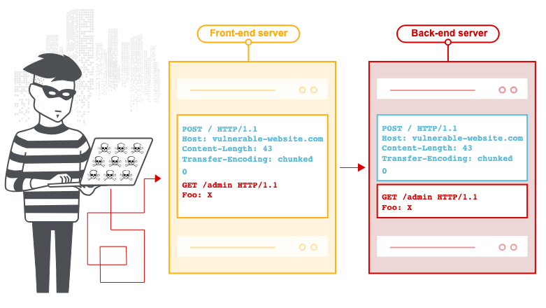
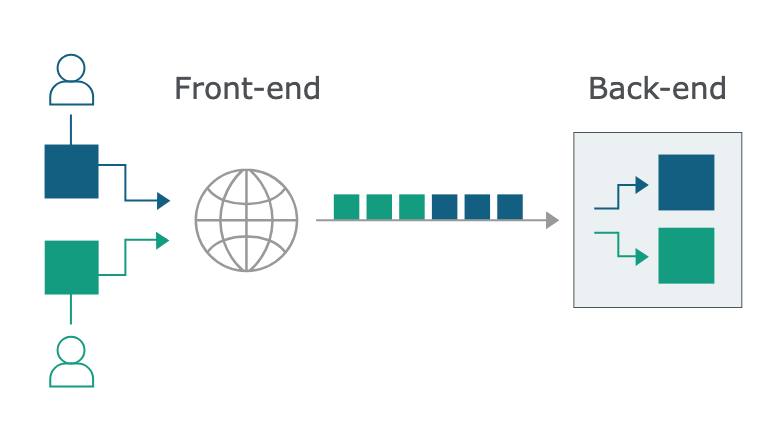
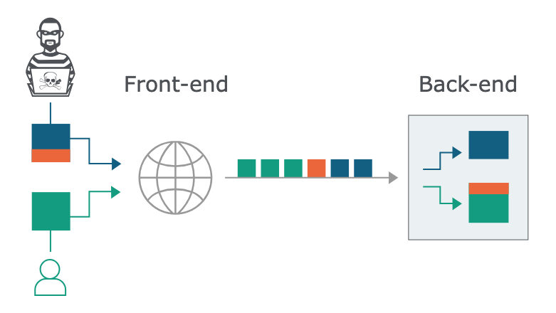

# HTTP 請求走私（HTTP Request Smuggling）

By: 1PingSun

Ref: [https://portswigger.net/web-security/request-smuggling](https://portswigger.net/web-security/request-smuggling)

---

在本節中，我們將解釋 HTTP 請求走私攻擊，並描述常見的請求走私漏洞是如何產生的。



圖片來源：[https://portswigger.net/web-security/request-smuggling](https://portswigger.net/web-security/request-smuggling)

## 什麼是 HTTP 請求走私？

HTTP 請求走私是一種干擾網站處理來自一個或多個用戶的 HTTP 請求序列的技術。請求走私漏洞通常具有嚴重性質，允許攻擊者繞過安全控制、獲得對敏感資料的未授權存取，並直接危害其他應用程式用戶。

請求走私主要與 HTTP/1 請求相關。然而，支援 HTTP/2 的網站可能也存在漏洞，這取決於其後端架構。

::: info PortSwigger 研究

HTTP 請求走私首次記錄於 2005 年，並因 PortSwigger 在該主題上的廣泛研究而重新受到關注。詳細資訊請查閱以下白皮書：

* [HTTP desync attacks: Request smuggling reborn](https://portswigger.net/research/http-desync-attacks-request-smuggling-reborn)
* [HTTP/2: The sequel is always worse](https://portswigger.net/research/http2)
* [Browser-powered desync attacks: A new frontier in HTTP request smuggling](https://portswigger.net/research/browser-powered-desync-attacks)
:::

## HTTP 請求走私攻擊中會發生什麼？

如今的 Web 應用程式經常在用戶與最終應用程式邏輯之間採用 HTTP 伺服器鏈。用戶向前端伺服器（有時稱為負載平衡器或反向代理）發送請求，該伺服器將請求轉發給一個或多個後端伺服器。這種架構類型在現代雲端應用程式中越來越常見，在某些情況下是不可避免的。

當前端伺服器將 HTTP 請求轉發到後端伺服器時，它通常會透過同一個後端網路連線發送多個請求，因為這樣更高效且效能更好。該協議非常簡單；HTTP 請求一個接一個地發送，接收伺服器必須確定一個請求在哪裡結束，下一個請求從哪裡開始：



圖片來源：[https://portswigger.net/web-security/request-smuggling](https://portswigger.net/web-security/request-smuggling)

在這種情況下，前端和後端系統對請求之間的邊界達成一致是至關重要的。否則，攻擊者可能能夠發送一個模糊的請求，該請求被前端和後端系統以不同方式解釋：



圖片來源：[https://portswigger.net/web-security/request-smuggling](https://portswigger.net/web-security/request-smuggling)

在這裡，攻擊者使其前端請求的一部分被後端伺服器解釋為下一個請求的開始。它實際上被加到下一個請求的前面，因此可以干擾應用程式處理該請求的方式。這就是請求走私攻擊，它可能造成毀滅性的後果。

## HTTP 請求走私漏洞是如何產生的？

大多數 HTTP 請求走私漏洞的產生是因為 HTTP/1 規範提供了兩種不同的方式來指定請求結束的位置：`Content-Length` 標頭和 `Transfer-Encoding` 標頭。

`Content-Length` 標頭很直接：它指定訊息主體的位元組長度。例如：

```http
POST /search HTTP/1.1
Host: normal-website.com
Content-Type: application/x-www-form-urlencoded
Content-Length: 11

q=smuggling
```

`Transfer-Encoding` 標頭可用於指定訊息主體使用分塊編碼。這意味著訊息主體包含一個或多個資料塊。每個資料塊由資料塊大小（以十六進位表示）組成，後面跟著換行符，然後是資料塊內容。訊息以大小為零的資料塊結束。例如：

```http
POST /search HTTP/1.1
Host: normal-website.com
Content-Type: application/x-www-form-urlencoded
Transfer-Encoding: chunked

b
q=smuggling
0
```

::: info Note

許多安全測試人員不知道分塊編碼可以在 HTTP 請求中使用，原因有二：

* Burp Suite 會自動解開分塊編碼，使訊息更容易查看和編輯。
* 瀏覽器通常不會在請求中使用分塊編碼，它通常只在伺服器回應中看到。
:::

由於 HTTP/1 規範提供了兩種不同的方法來指定 HTTP 訊息的長度，因此單個訊息可能同時使用這兩種方法，使它們相互衝突。規範試圖透過說明如果 `Content-Length` 和 `Transfer-Encoding` 標頭都存在，那麼應該忽略 `Content-Length` 標頭來防止這個問題。當只有一個伺服器在運作時，這可能足以避免歧義，但當兩個或更多伺服器連接在一起時就不行了。在這種情況下，問題可能因為兩個原因而產生：

* 某些伺服器不支援請求中的 `Transfer-Encoding` 標頭。
* 某些支援 `Transfer-Encoding` 標頭的伺服器，如果標頭以某種方式被混淆，可能會被誘導不處理它。

如果前端和後端伺服器在處理（可能被混淆的）`Transfer-Encoding` 標頭時表現不同，那麼它們可能對連續請求之間的邊界產生分歧，導致請求走私漏洞。

::: info Note

使用端到端 HTTP/2 的網站本質上不受請求走私攻擊影響。由於 HTTP/2 規範引入了單一、穩健的機制來指定請求長度，攻擊者無法引入所需的歧義。

然而，許多網站有一個支援 HTTP/2 的前端伺服器，但將其部署在僅支援 HTTP/1 的後端基礎設施前面。這意味著前端實際上必須將它接收到的請求翻譯成 HTTP/1。這個過程稱為 HTTP 降級。更多資訊請參見[進階請求走私](https://portswigger.net/web-security/request-smuggling/advanced)。
:::

## 如何執行 HTTP 請求走私攻擊

經典的請求走私攻擊涉及將 `Content-Length` 標頭和 `Transfer-Encoding` 標頭都放入單個 HTTP/1 請求中，並操縱這些標頭使前端和後端伺服器以不同方式處理請求。具體的執行方式取決於兩個伺服器的行為：

* **CL.TE**：前端伺服器使用 `Content-Length` 標頭，後端伺服器使用 `Transfer-Encoding` 標頭。
* **TE.CL**：前端伺服器使用 `Transfer-Encoding` 標頭，後端伺服器使用 `Content-Length` 標頭。
* **TE.TE**：前端和後端伺服器都支援 `Transfer-Encoding` 標頭，但其中一個伺服器可以透過某種方式混淆標頭而被誘導不處理它。

::: info Note

這些技術只能使用 HTTP/1 請求執行。瀏覽器和其他客戶端（包括 Burp）預設使用 HTTP/2 與在 TLS 握手期間明確宣告支援它的伺服器通訊。

因此，當測試支援 HTTP/2 的網站時，您需要在 Burp Repeater 中手動切換協議。您可以從 **Inspector** 面板的 **Request attributes** 區段執行此操作。
:::

### CL.TE 漏洞

在這裡，前端伺服器使用 `Content-Length` 標頭，後端伺服器使用 `Transfer-Encoding` 標頭。我們可以執行簡單的 HTTP 請求走私攻擊如下：

```http
POST / HTTP/1.1
Host: vulnerable-website.com
Content-Length: 13
Transfer-Encoding: chunked

0

SMUGGLED
```

前端伺服器處理 `Content-Length` 標頭，並確定請求主體長度為 13 位元組，直到 `SMUGGLED` 的結尾。此請求被轉發到後端伺服器。

後端伺服器處理 `Transfer-Encoding` 標頭，因此將訊息主體視為使用分塊編碼。它處理第一個資料塊，該資料塊被聲明為零長度，因此被視為終止請求。接下來的位元組 `SMUGGLED` 未被處理，後端伺服器會將這些位元組視為序列中下一個請求的開始。

::: tip Lab: [HTTP request smuggling, basic CL.TE vulnerability](https://portswigger.net/web-security/request-smuggling/lab-basic-cl-te)

1. 此 Lab 情境為使用前端和後端兩台伺服器處理請求，前端伺服器不會解析 `Transfer-Encoding`，後端則會。前端伺服器不接受 `GET` 和 `POST` 以外的請求，要想辦法成功向後端發送 `GPOST` 請求以完成此 Lab。
2. 在 Burp Repeater 頁面的 Request attributes 部分設定使用 HTTP/1 進行請求
3. 使用以下請求發送兩次，就可以對後端伺服器進行 `GPOST` 請求，完成此 Lab。
    ```http
    POST / HTTP/1.1
    Host: YOUR-LAB-ID.web-security-academy.net
    Content-Length: 6
    Transfer-Encoding: chunked

    0

    G
    ```
:::

### TE.CL 漏洞

在這裡，前端伺服器使用 `Transfer-Encoding` 標頭，後端伺服器使用 `Content-Length` 標頭。我們可以執行簡單的 HTTP 請求走私攻擊如下：

```http
POST / HTTP/1.1
Host: vulnerable-website.com
Content-Length: 3
Transfer-Encoding: chunked

8
SMUGGLED
0
```

::: info Note

要使用 Burp Repeater 發送此請求，您首先需要進入 Repeater 選單並確保 "Update Content-Length" 選項未勾選。

您需要在最後的 `0` 後面包含尾隨序列 `\r\n\r\n`。
:::

前端伺服器處理 `Transfer-Encoding` 標頭，因此將訊息主體視為使用分塊編碼。它處理第一個資料塊，該資料塊被聲明為 8 位元組長，直到 `SMUGGLED` 後面行的開始。它處理第二個資料塊，該資料塊被聲明為零長度，因此被視為終止請求。此請求被轉發到後端伺服器。

後端伺服器處理 `Content-Length` 標頭，並確定請求主體長度為 3 位元組，直到 `8` 後面行的開始。接下來的位元組，從 `SMUGGLED` 開始，未被處理，後端伺服器會將這些位元組視為序列中下一個請求的開始。

::: tip Lab: [HTTP request smuggling, basic TE.CL vulnerability](https://portswigger.net/web-security/request-smuggling/lab-basic-te-cl)

1. 連續發送以下請求兩次，完成此 Lab（注意結尾的 `\r\n` 數量）。
    ```http
    POST / HTTP/1.1
    Host: YOUR-LAB-ID.web-security-academy.net
    Content-Type: application/x-www-form-urlencoded
    Content-Length: 4
    Transfer-Encoding: chunked

    5b
    GPOST / HTTP/1.1
    Content-Type: application/x-www-form-urlencoded
    Content-Length: 3

    x=1
    0

    ```
:::

### TE.TE 行為：混淆 TE 標頭

在這裡，前端和後端伺服器都支援 `Transfer-Encoding` 標頭，但其中一個伺服器可以透過某種方式混淆標頭而被誘導不處理它。

混淆 `Transfer-Encoding` 標頭有無數種潛在方式。例如：

```http
Transfer-Encoding: xchunked

Transfer-Encoding : chunked

Transfer-Encoding: chunked

Transfer-Encoding: x

Transfer-Encoding:[tab]chunked

[space]Transfer-Encoding: chunked

X: X[\n]Transfer-Encoding: chunked

Transfer-Encoding
: chunked
```

這些技術中的每一種都涉及對 HTTP 規範的微妙偏離。實作協議規範的真實世界程式碼很少絕對精確地遵守它，不同的實作容忍規範的不同變化是很常見的。要發現 TE.TE 漏洞，需要找到 `Transfer-Encoding` 標頭的某種變化，使得只有前端或後端伺服器之一處理它，而另一個伺服器忽略它。

根據是前端還是後端伺服器可以被誘導不處理混淆的 `Transfer-Encoding` 標頭，攻擊的其餘部分將採取與已描述的 CL.TE 或 TE.CL 漏洞相同的形式。
