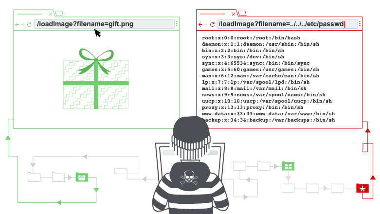

# 路徑遍歷（Path Traversal）

By: 1PingSun

Ref: [https://portswigger.net/web-security/file-path-traversal](https://portswigger.net/web-security/file-path-traversal)

---

在這個章節中，將說明以下內容：

* 什麼是路徑遍歷
* 如何進行路徑遍歷攻擊並繞過常見的阻擋
* 如何防禦路徑遍歷漏洞



圖片來源：[https://portswigger.net/web-security/file-path-traversal](https://portswigger.net/web-security/file-path-traversal)

## 什麼是路徑遍歷

路徑遍歷 Path traversal 也被稱為 directory traversal，這個漏洞允許攻擊讀取執行中應用的伺服器上的任意檔案。這可能包含：

* 應用的程式與資料
* 後端系統的憑證
* 敏感的作業系統檔案

在某些情況，攻擊者能夠修改伺服器上的任意檔案，進而修改應用的資料或行為，最後完全控制伺服器。

<iframe width="560" height="315" src="https://www.youtube.com/embed/NQwUDLMOrHo?si=p4UnKX7sEKNKIPWB" title="YouTube video player" frameborder="0" allow="accelerometer; autoplay; clipboard-write; encrypted-media; gyroscope; picture-in-picture; web-share" referrerpolicy="strict-origin-when-cross-origin" allowfullscreen></iframe>

## 透過路徑遍歷讀取任意檔案

想像有一個購物應用，顯示商品的照片，這會透過以下的 HTML 載入圖片：

```html

```

`loadImage` URL 帶有一個 `filename` 參數，且會回傳指定檔案的內容。圖片檔案被儲存在伺服器的 `/var/www/images/` 路徑。為了能夠回傳圖片，應用會將請求的檔案名稱加到基礎資料夾後方，接著透過檔案系統 API 讀取檔案。換句話說，應用會讀取以下路徑：

```raw
/var/www/images/218.png
```

這個應用沒有針對路徑遍歷攻擊進行任何的防禦，最後造成攻擊者可以透過以下 URL 讀取伺服器檔案系統上的 `/etc/passwd` 檔案：

```raw
https://insecure-website.com/loadImage?filename=../../../etc/passwd
```

這是因為應用會讀取以下檔案路徑：

```raw
/var/www/images/../../../etc/passwd
```

`../` 在檔案路徑中是有效的片段，代表在資料夾架構中向上一層。連續三個 `../` 將路徑 `/var/www/images/` 依序向上到根目錄，所以實際讀取的檔案是：

```raw
/etc/passwd
```

在 Unix 作業系統中，這是一個標準檔，包含伺服器上註冊的使用者詳細資訊，但攻擊者可以用相同的技術存取其他任意的檔案。

在 Windows 作業系統中，`../` 和 `..\` 都是有效的資料夾遍歷片段，以下是基於 Windows 伺服器相同效果的攻擊範例：

```raw
https://insecure-website.com/loadImage?filename=..\..\..\windows\win.ini
```

::: tip **Lab: [File path traversal, simple case](https://portswigger.net/web-security/file-path-traversal/lab-simple)**
1. 打開後看到多張圖片
2. 選擇任一圖片點擊右鍵 > 在新分頁中開啟
3. 發現路徑為 `/image?filename=34.jpg`
4. 嘗試將路徑改為 `../../../etc/passwd`，即可存取 `/etc/passwd` 檔案並完成此 Lab
:::

## 路徑遍歷漏洞利用的常見阻擋

許多讓使用者輸入檔案路徑的應用都會設定針對路徑遍歷的防禦，這些防禦經常能夠被繞過。

如果應用在使用者提供的檔案路徑中，將路徑遍歷的片段剝離或禁止，則有許多技術能夠繞過防禦。

你可以直接輸入檔案系統根目錄中的絕對位置，在無需任何遍歷片段的情況下直接存取檔案，例如：`filename=/etc/passwd`。

::: tip **Lab: [File path traversal, traversal sequences blocked with absolute path bypass](https://portswigger.net/web-security/file-path-traversal/lab-absolute-path-bypass)**
1. 打開後看到多張圖片
2. 選擇任一圖片點擊右鍵 > 在新分頁中開啟
3. 發現路徑為 `/image?filename=31.jpg`
4. 嘗試將路徑改為 `/etc/passwd`，即可存取該檔案並完成此 Lab
:::

你也可以使用巢狀遍歷片段，例如：`....//` 或 `....\/`。當裡面的片段會被剝離的時候，可以恢復成簡單的路徑遍歷片段。

::: tip **Lab: [File path traversal, traversal sequences stripped non-recursively](https://portswigger.net/web-security/file-path-traversal/lab-sequences-stripped-non-recursively)**
1. 打開後看到多張圖片
2. 選擇任一圖片點擊右鍵 > 在新分頁中開啟
3. 發現路徑為 `/image?filename=29.jpg`
4. 嘗試將路徑改為 `....//....//....//etc/passwd`，即可存取 `/etc/passwd` 檔案並完成此 Lab
:::

在一些情況下，例如在 URL 路徑或 `multipart/form-data` 請求的 `filename` 參數中，網站伺服器會在傳送你的輸入到應用前，剝離任何的路徑遍歷片段。有時你可以透過 URL 編碼或雙重 URL 編碼 `../` 的字元繞過這類阻擋，編碼後分別為 `%2e%2e%2f` 以及 `%252e%252e%252f`。其他非標準的編碼也可能有效，例如 `..%c0%af` 或 `..%ef%bc%8f`。

對於 Burp Suite 的 Professional 使用者，Burp Intruder 提供預先設定的 **Fuzzing - path traversal** 清單 Paylaod，其中包含一些可以嘗試的經過編碼的路徑遍歷參數。

::: tip **Lab: [File path traversal, traversal sequences stripped with superfluous URL-decode](https://portswigger.net/web-security/file-path-traversal/lab-superfluous-url-decode)**
1. 打開後看到多張圖片
2. 選擇任一圖片點擊右鍵 > 在新分頁中開啟
3. 發現路徑為 `/image?filename=31.jpg`
4. 嘗試將路徑改為 `%252e%252e%252f%252e%252e%252f%252e%252e%252fetc/passwd`，即可存取 `/etc/passwd` 檔案並完成此 Lab
:::

應用可能要求使用者提供以預期的基礎資料夾路徑開頭的檔案名稱，例如：`/var/www/images`。在這個例子當中，有可能包含要求的基礎資料夾，並在後面加上適當的路徑遍歷片段，例如：`filename=/var/www/images/../../../etc/passwd`。

::: tip **Lab: [File path traversal, validation of start of path](https://portswigger.net/web-security/file-path-traversal/lab-validate-start-of-path)**
1. 打開後看到多張圖片
2. 選擇任一圖片點擊右鍵 > 在新分頁中開啟
3. 發現路徑為 `/image?filename=/var/www/images/22.jpg`
4. 嘗試將路徑改為 `/image?filename=/var/www/images/../../../etc/passwd`，即可存取 `/etc/passwd` 檔案並完成此 Lab
:::

應用可能要求使用者提供的檔案名稱結尾為預期的特定檔案副檔名，例如：`.png`。在這個情況中，有機會在要求的檔案副檔名前面透過無效的字節中斷檔案路徑，例如：`filename=../../../etc/passwd%00.png`。

::: tip **Lab: [File path traversal, validation of file extension with null byte bypass](https://portswigger.net/web-security/file-path-traversal/lab-validate-file-extension-null-byte-bypass)**
1. 打開後看到多張圖片
2. 選擇任一圖片點擊右鍵 > 在新分頁中開啟
3. 發現路徑為 `/image?filename=66.jpg`
4. 嘗試將路徑改為 `/image?filename=../../../etc/passwd%00.jpg`，即可存取 `/etc/passwd` 檔案並完成此 Lab
:::

## 防禦路徑遍歷漏洞

對於防禦路徑遍歷最有效的方法是避免直接完全的將使用者的輸入傳送到檔案系統 APIs 上。許多應用程式的函數能夠將其重寫，以更安全的方式提供執行行為。

如果你無法避免傳送使用者的輸入到檔案系統 APIs，建議使用兩層的防禦以防止攻擊：

* 在處理使用者的輸入前進行驗證。在理想情況下，將使用者的輸入與允許的白名單進行比較。如果無法做到這一點，驗證使用者的輸入是否僅包含允許的內容，例如：只允許英文字母大小寫字元。
* 在驗證提供的輸入後，在基礎資料夾後方加上輸入，使用平台的文件系統 API 標準化路徑，驗證標準化的路徑是否開始與基礎資料夾。

以下是一個簡單的 Java 程式範例，用於驗證標準化後的使用者輸入：

```java
File file = new File(BASE_DIRECTORY, userInput);
if (file.getCanonicalPath().startsWith(BASE_DIRECTORY)) {
    // process file
}
```

::: info Read more

* [透過 Burp Suite 的網站漏洞掃描器找到路徑遍歷漏洞](https://portswigger.net/burp/vulnerability-scanner)
:::
