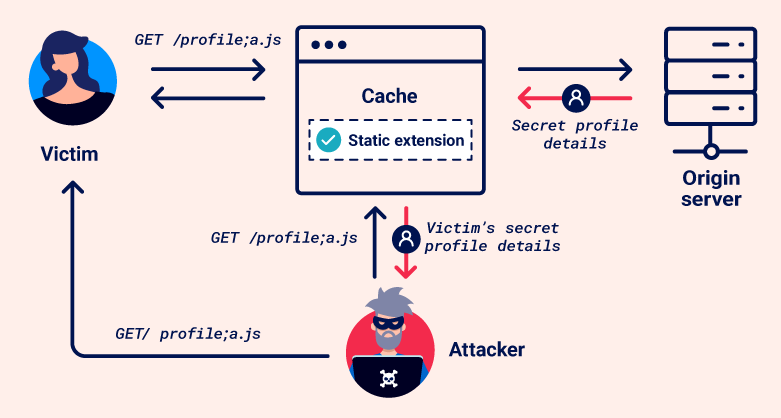
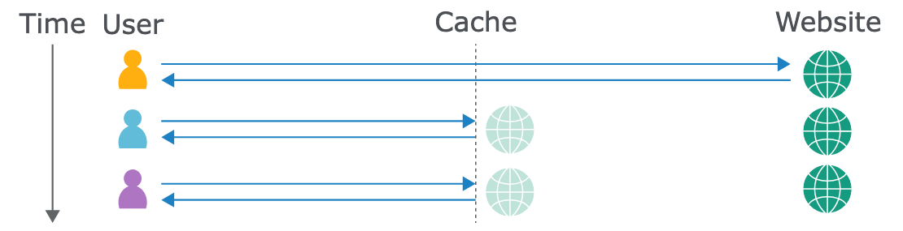

# 網頁快取詐欺（Web Cache Deception）

By: 孫逸平

Ref: [https://portswigger.net/web-security/web-cache-deception](https://portswigger.net/web-security/web-cache-deception)

---

網頁快取詐欺漏洞允許攻擊者儲存敏感、動態資料在快取伺服器上，網頁快取漏洞的攻擊會讓受害者造訪惡意的連結（URL），使受害者模糊的請求敏感資料，快取伺服器會以為是靜態資料因此將其回覆（Response）儲存，最後攻擊者使用相同的連結（URL）請求，就能在未經驗證的情況下獲得敏感資料。



圖片來源：[https://portswigger.net/web-security/web-cache-deception/images/wcd-image-1.png](https://portswigger.net/web-security/web-cache-deception/images/wcd-image-1.png)

> [!Note]
>
> Web cache poisoning 和 Web cache deception 的操作方式是不同：
>
> * Web cache poisoning 是操作快取金鑰（Cache key）注入惡意的內容並儲存在快取伺服器上，接著讓其他使用者存取。
> * Web cache deception 則是透過欺騙快取規則（Cache rules）儲存敏感資料，使攻擊者能夠存取。

## 網頁快取（Web Cache）

網頁快取（Web cache）是一個系統位於原始伺服器和使用者之間，當客戶端請求一個靜態資源時，會先被導向到快取伺服器。如果快取伺服器沒有備份的資源，則會導向到原始伺服器，而回應則會先儲存在快取再回傳給使用者。快取使用預先配置的規則去決定要儲存那些回應。

之後如果有使用者存取相同的資源，快取伺服器會直接回應之前儲存的資源給使用者。



圖片來源：[https://portswigger.net/web-security/images/caching.svg](https://portswigger.net/web-security/images/caching.svg)

快取成為常見且重要的途徑來傳送網頁內容，尤其使用將資料副本儲存在全世界分散的伺服器上的 Content Delivery Networks（CDNs）。CDNs 透過最小化傳輸距離，降低了伺服器傳送到使用者的時間。

### 快取金鑰（Cache Key）

當快取伺服器收到 HTTP 請求，會判斷要直接回傳資料或是需要導向請求到原始伺服器。快取會透過 HTTP 請求中的相關資料生成成「cache key」。例如：使用 URL 路徑、查詢參數等生成，也可以連同其他資料，包含表頭、資料類型等一起加入生成。

如果收到的請求 cache key 與先前的請求相同，則快取會認定為相同的資料並儲存一份副本。

### 快取規則（Cache Rules）

快取規則（Cache rules）能夠決定資料是否要儲存在快取伺服器上、要儲存多久。快取規則通常設定儲存不經常變動且重複使用在多個頁面的靜態資源。動態資料則因為較有可能包含敏感資料，所以不會儲存在，並確保使用者能夠直接存取到原始伺服器上的最新資料。

攻擊者利用快取規則進行網頁快取詐欺（Web cache deception），所以了解不同類型的規則相當重要。尤其根據一些在請求 URL 路徑中的字串，例如：

* 靜態資料副檔名規則：這個規則會判斷請求資源的檔案副檔名，包含 `.css`（樣式檔）、`.js`（JavaScipt 檔）等。
* 靜態資料夾規則：這個規則會判斷請求 URL 路徑是否開始於一些只會儲存靜態的資料夾名稱，包含：`/static`、`/assets` 等。
* 檔案名稱規則：這個規則會判斷檔案名稱是否符合一些網頁操作用的檔案，且很少變更，包含：`robots.txt`、`favicon.ico` 等。

快取也有可能設定一些自定義規則，例如：參考 URL 參數或動態進行分析等。

## 構成網頁快取詐欺

通常，攻擊者進行網頁快取詐欺需要以下步驟：

1. 辨別動態回應中包含敏感資料的目標端點。在 Burp 中查看回應，因為有些敏感資訊可能無法直接在頁面上看到。專注在支援 `GET`、`HEAD`、`OPTIONS` 方法的端點，因為改變伺服器狀態的請求通常不會被快取儲存。
2. 辨別快取伺服器和原始伺服器在解析 URL 路徑不一致的地方。他們在以下幾點有可能有差異：
   * 如何對應 URL 和資源
   * 如何處理特殊符號
   * 如何規範路徑
3. 透過不一致之處製作一個惡意的 URL，用以欺騙快取儲存動態回應。當受害者造訪這個 URL，回應資料會被儲存在快取。然後攻擊者可以使用 Burp 存取相同的 URL 以取得包含受害者資料的回應。應避免使用瀏覽器直接操作，因為有些應用程式會因為沒有會話（Session）重新導向使用者或使本地端的資料無線，這有可能會因此漏洞。

我們將探索構成網頁快取詐欺的不同方法。

### 破壞快取

在測試不一致之處以及進行網頁快取詐欺漏洞利用時，需確認每個請求的 cache key 不同，否則可能會影響快取的回應結果。

在這些 URL 當中，如果有 URL 路徑或任何被加入到 cache key 的查詢參數，可以在每次傳送請求時，將查詢字串加入路徑。Param Miner 插件可以自動化完成這些動作。要使用 Param Miner，可以先下載套件，接著在上方點擊 **Parmam miner > Settings**，然後點擊 **Add dynamic cachebuster**。現在 Burp 新增獨一無二的查詢字串到每個請求中，可以透過 **Logger** 分頁查看新增的查詢字串。

### 識別快取回應

在進行測試時，辨別快取的回應相當重要，你可以觀察回應封包的表頭以及回應封包的時間。

透過回應封包的表頭，有一些不同的跡象能夠判讀資料是否來自快取，例如：

* 可以透過 `X-Cache` 表頭提供是否來自快取的相關資訊，常見的值包含：
  * `X-Cache: hit`：回應是從快取提供的。
  * `X-Cache: miss`：快取不包含請求金鑰的回應，資料存取自原始伺服器。但通常回應都有被快取，透過再次發送請求觀察是否變成 `hit` 值來確定。
  * `X-Cache: dynamic`：原始伺服器生成的內容，通常表示快取伺服器上沒有適合的快取。
  * `X-Cache: refresh`：快取的資料已過期，需要重新存取或重新驗證。
* `Cache-Control` 表頭包含指出快取方向的資訊，例如 `public` 的 `max-age` 值大於 `0`。注意：這只代表資源能夠快取，不永遠表示來自快取，因為快取有時候可能覆蓋這個表頭。

如果你發現兩相同請求的回應時間有巨大差異，有可能表示較快的回應來自快取。

## 利用靜態檔副檔名快取規則

快取規則經常透過檔案副檔名（包含：`.css`、`.js` 等），判斷靜態資源，這也是 CDNs 中最常見的行為。

如果快取和原始伺服器解析 URL 的方式不一致，或使用分隔符號，攻擊者有機會能夠製作一個動態資源的請求並使用靜態資源的副檔名，讓原始伺服器不會理會，但快取會解析。

### 路徑解析不一致

URL 解析是一個把 URL 和伺服器上的資源聯結起來的過程，包含：檔案、腳本、執行指令等。他們有可能使用不同的框架或技術，導致解析方式不同，兩個常見的傳統 URL 轉換和 RESTful URL 轉換。

傳統 URL 轉換會將路徑轉換成系統上的檔案，這裡有一個典型的範例：`http://example.com/path/in/filesystem/resource.html`

* `http://example.com` 指向伺服器。
* `/path/in/fiflesystem` 描述伺服器檔案系統的資料夾路徑。
* `resource.html` 指定存取的檔案。

相較之下，REST-style 的 URL 不會直接對應實體的檔案結構，他們將檔案路徑抽象化為 API 的邏輯部分：`http://example.com/path/resource/param1/param2`

* `http://example.com` 指向伺服器。
* `/path/resource/` 是一個端點描述資源。
* `param1` 和 `param2` 是提供伺服器處理請求使用的路徑參數。

快取和原始伺服器將 URL 路徑對應資源的方式不同，可能造成網頁快取詐欺漏洞。考慮以下範例：`http://example.com/user/123/profile/wcd.css`

* 原始伺服器使用 REST-sytle URL 轉換會解釋這是一個端點 `/user/123/profile` 的請求，並回傳使用者 `123` 的個人資料資訊，而不會處理沒有意義的參數 `wcd.css`。
* 快取伺服器使用傳統的 URL 轉換，會解釋成請求位於路徑 `/user/123/profile` 的檔案 `wcd.css`。如果快取的配置設定會儲存路徑結尾為 `.css` 的回應資料，它就會把個人資料當作 CSS 檔儲存在快取。

### 利用路徑解析不一致

為了測試原始伺服器如何將 URL 路徑轉換資源，可以在目標路徑後面加上一些隨意的部分路徑。如果都回應與原始請求相同的敏感資料，那表示原始伺服器並非只是使用傳統方式解析 URL 路徑，而是會忽略後面部分。例如，這個例子將 `/api/orders/123` 修改成 `/api/orders/123/foo` 仍然回傳相同資訊。

為了測試快取如何轉換 URL 路徑，你需要嘗試將路徑加上靜態副檔名，以符合快取規則。例如：將 `/api/orders/123/foo` 修改成 `/api/orders/123/foo.js`。如果回應資料被快取儲存，這表示：

* 快取把它當成靜態資源。
* 快取規則會儲存請求結尾為 `.js` 的回應。

快取有很多的基本規則是判斷特定的副檔名，可嘗試其他副檔名，包含：`.css`、`.ico` 以及 `.exe`。

接著你可以製作回應儲存在快取的動態資源 URL。注意：這個攻擊有限制的特定結尾，原始伺服器通常有其他不同的規則處理不同的結尾。

> [!note]
> Burp Scanner 自動偵測路徑解析不同造成的網頁快取詐欺漏洞，也可以使用 [Web Cache Deception Scanner](https://portswigger.net/bappstore/7c1ca94a61474d9e897d307c858d52f0) BApp 偵測錯誤配置的網頁快取。

* **Lab: [Exploiting path mapping for web cache deception](https://portswigger.net/web-security/web-cache-deception/lab-wcd-exploiting-path-mapping)**
  1. 偵查目標
     1. 使用帳號 `wiener`、密碼 `peter` 登入。
     2. 發現回應包含 API key
  2. 辨識路徑解析不一致
     1. 發送 `/my-account/abc` 路徑的請求，發現回應資料仍然包含你的 API Key，表示原始伺服器將其解析成 `/my-account`。
     2. 在 URL 路徑加上副檔名，例如：`/my-account/abc.js`，接著發送請求。發現回應包含 `X-Cache: miss`（表示回應不是從快取提供）和 `Cache-Control: max-age=30`（表示會被儲存 30 秒）表頭。
     3. 在 30 秒內重新傳送請求，發現表頭 `X-Cache` 的數字變成 `hit`，表示回應資料來自快取。由此可以推斷快取解釋 URL 路徑為 `/my-account/abc.js` 並符合 `.js` 副檔名的快取規則。所以可以使用這個 payload 進行利用。
  3. 進行漏洞利用
     1. 在網站中點擊 **Go to exploit server**
     2. 在 **Body** 部分讓受害者（`carlos`）跳轉到你製作的惡意 URL。需注意應修改路徑後方的參數，以避免受害者存取到你之前存取的快取回應。
      ```
      <script>document.location="https://YOUR-LAB-ID.web-security-academy.net/my-account/wcd.js"</script>
      ```
     3. 點擊 **Deliver exploit to victim**。當受害者存取該 URL，回應會儲存在快取。
     4. 前往提供給受害者（`carlos`）存取的路徑（`https://YOUR-LAB-ID.web-security-academy.net/my-account/wcd.js`），就可以看到 `carlos` 的 API Key 了。

### 分隔方式不一致

分隔符號能夠將 URL 區分成不同物件，通常是一個標準化的資源或字串，例如：`?` 通常用於分隔 URL 路徑和查詢字串。然而，因為 URL RFC 標準規定的非常寬鬆，導致在不同框架和技術間仍然存在差異。

快取和原始伺服器若使用字元和字串分隔存在差異，就有可能造成網頁快取詐欺漏洞。例如範例 `/profile;foo.css`：

* 原始伺服器若使用 Java Spring 框架，將使用 `；` 作為分隔符號，會忽略 `；` 後面的路徑，並依據路徑 `/profile` 回傳個人資料資訊。
* 幾乎其他框架都不使用 `；` 分隔，因此快取若不使用 Java Spring，很可能解析 `；` 和後面的所有路徑。如果快取規則會儲存請求結尾為 `.css` 的回應，個人資料資訊就會被當作 CSS 檔儲存在快取。

同樣情況耶發生在其他字元使用不同框架或技術。使用 Ruby on Rails 框架的原始伺服器使用 `.` 分隔符號指定回應格式：

* `/profile`：請求會處理預設的 HTML 格式，並傳回個人資料資訊。
* `/profile.css`：此請求被判斷為 CSS 副檔名，沒有相應的處理，所以請求不被接受並回傳錯誤。
* `/profile.ico`：此請求為 `.ico` 副檔名，Ruby on Rails 無法辨識該副檔名，因此使用預設 HTML 格式處理，並回傳個人資料資訊。如果快取被設定為儲存 `.ico` 結尾的請求回應，個人資料資訊將被當作靜態檔案儲存在快取。

編碼的字元有時候也可以作為分隔符號，例如請求 `/profile%00foo.js`：

* OpenLiteSpeed 伺服器使用編碼的空字元 `%00` 作為分隔資源。因此一個使用 OpenLiteSpeed 的原始伺服器會將此路徑解析成 `/profile`。
* 其他常見的框架遇到 `%00` 在 URL 中時，會回應錯誤。然而如果快取使用 Akamai on Fastly，就會解析路徑中 `%00` 和後面的所有東西。

### 利用分隔方式不一致

你可以利用分隔不一致，在路徑中加入快取會解析但原始伺服器不會的靜態副檔名。若要利用分隔不一致，需要確認分隔字元被原始伺服器解析成分隔符號，但快取不會解析的。

首先，找到被原始伺服器當作分隔符號的資源。一開始可以加上任意的字串到目標 URL，例如：將 `/setting/users/list` 修改成 `/settings/users/listaaa`。當你開始測試分隔字元時，將使用回應作為參考。

> [!note]
> 如果回應資料和原始回應相同，表示請求被轉向了，你需要選擇其他不同的端點作為測試。

接著，在原始路徑和任意的字串間加上可能的分隔符號，例如 `/settings/users/list;aaa`：

* 如果回應與原始請求的回應相同，表示字元 `;` 被當作分隔符號，且原始伺服器將其解釋為路徑 `/settings/users/list`。
* 如果回應與任意字串相符，表示字元 `;` 沒有被當作分隔符號，且原始伺服器將其解析為 `/settings/users/list;aaa`。

一旦你找到被原始伺服器當作分隔符號的字元，就要測試這個字元是否也被快取伺服器作為分隔符號。要做到這件事，在路徑結尾加上靜態副檔名。如果回應被快取儲存表示：

* 快取不使用分隔符號，而是使用靜態副檔名解析完整的 URL 路徑。
* 快取規則會儲存結尾為 `.js` 的請求回應。

確保測試所有的 ASCII 字元以及一些常見的副檔名，包含 `.css`、`.ico` 和 `.exe` 等。這裡有一個常見分隔符號字元的清單 [Web cache deception lab delimiter list](https://portswigger.net/web-security/web-cache-deception/wcd-lab-delimiter-list)。使用 Burp Intruder 快速測試這些字元，為了避免 Burp Intruder 自動編碼分隔字元，要在 **Payloads** 側邊欄中的 **Payload encoding** 下，關閉「Burp Intruder's automated character encoding」。

你可以創建一個出發靜態副檔名快取規則的漏洞利用。例如，payload `/settings/users/list;aaa.js`，原始伺服器使用 `;` 作為分隔符號：

* 快取解析路徑為 `/settings/users/list;aaa.js`。
* 原始伺服器解析路徑為 `/settings/users/list`。

原始伺服器回傳被快取儲存的動態個人資料資訊。

由於分隔符號在每個伺服器通常使用一樣，你可以在各種不同的端點使用此攻擊。

> [!note]
> 
> 在瀏覽器向快取請求前，有寫分隔字元會先被受害者的瀏覽器處理。這表示有寫分隔符號無法被拿來進行攻擊利用。例如，瀏覽器獎 `{`、`}`、`<`、`<`、`#` 等字元編碼以分割路徑。
> 
> 如果快取或原始伺服器將這些字元解碼，在漏洞利用時可能會使用編碼的版本。

* **Lab: [Exploiting path delimiters for web cache deception](https://portswigger.net/web-security/web-cache-deception/lab-wcd-exploiting-path-delimiters)**
   1. 偵查：使用 Burp Intruder 嘗試不同分隔字元，判斷原始伺服器會解析哪些分隔符號
      1. 將請求傳送到 Intruder
      2. 加上參數
         
      3. 將 [Web cache deception lab delimiter list](https://portswigger.net/web-security/web-cache-deception/wcd-lab-delimiter-list) 中的字元貼上到 payload 的地方
      4. 取消勾選 URL-encode these characters 選項
      5. 點擊 Start attack 完成攻擊後，會發現只有字元 `?` 和 `;` 回應 200，其他都是 404
   2. 偵查：判斷是否會被快取儲存
      1. 使用 `?` 字元作為分隔符號會發現 header 沒有快取的痕跡
         
      2. 使用 `;` 字元作為分隔符號連續請求兩次，發現 header 有被快取儲存的跡象
         
         
   3. 漏洞利用
      1. 在 Go to exploit server 的 body 撰寫 payload
         ```
         <script>document.location="https://YOUR-LAB-ID.web-security-academy.net/my-account;wcd.js"</script>
         ```
      2. 接著前往路徑 `https://YOUR-LAB-ID.web-security-academy.net/my-account;wcd.js` 就可以拿到受害者的 API key 了！

### 分隔資源解碼不一致

網頁有時候需要在包含一些特殊意義字元的 URL 傳送資料，例如：分隔符號。為了確保這些字元被解析為數據，通常都會編碼。然而，有些語法會在處理 URL 前，解碼有把握的字元。如果分隔字元被解碼，他會被當作分隔符號切段 URL 路徑。

快取和來源伺服器對分隔符號的解碼方式不同，就算都使用相同的字元作為分隔符號，也會造成它們對 URL 路徑的解析出現差異。例如 `/profile%23wcd.css` 使用 URL-encoded 字元 `#`：

* 原始伺服器將 `%23` 解碼成 `#1`，他視 `#` 為分隔符號，所以解析路徑為 `/profile` 並回傳個人資料頁面。
* 快取伺服器也會將 `#` 視為非個符號，但不會解碼 `%23`，因此解析為路徑 `/profile%23wcd.css`。如果快取規則會儲存副檔名 `.css`，則回應會被儲存。

另外，有些快取伺服器會先解碼 URL，再將編碼後的 URL 進行請求。另一個情況快取規則先比對編碼的 URL，然後再解碼 URL 並向下一個伺服器請求。這樣的行為也仍然可以造成快取與原始伺服器解析 URL 路徑不一致，以 `/myaccount%3fwcd.css` 為例：

* 快取伺服器使用編碼的路徑 `/myaccount%3fwcd.css` 應用到快取規則，並儲存回應，因為符合 `.css` 副檔名的規則。接著將 `%3f` 解碼成 `?` 並向原始伺服器發送解碼後的 URL。
* 原始伺服器收到請求 `/myaccount?wcd.css`，使用 `?` 字元作為分隔符號，所以解析路徑為 `/myaccount`。

### 利用分隔符號解碼不一致

利用解碼不一致，你可以使用編碼的符號在路徑加上靜態副檔名，使快取認定為靜態資源，但原始伺服器則非。

使用與「利用分隔符號不一致」的相同方式進行辨識與利用，不同之處為使用編碼的字元。確保有測試一些編碼的非可視字元，尤其是 `%00`、`%0a` 和 `%09`。如果這些字元被解碼，同樣也可以切斷 URL 路徑。

## 利用靜態資料夾快取規則

網路伺服器經常將靜態資源儲存在一些特定的資料夾，快取規則經常判斷符合特定 URL 路徑，把這些資料夾作為目標，例如：`/static`、`/assets`、`/scripts` 或 `/images`。這個規則也可能造成網頁快取詐欺漏洞。

> [!note]
>
> 為了利用靜態資料夾快取規則，你需要了解基本的路徑遍歷攻擊。詳見：[Path traversal](https://portswigger.net/web-security/file-path-traversal)

### 標準化不一致

標準化會將各種不同格式的 URL 路徑轉換成標準格式。有時候包含解碼編碼的字元和「點」，但在不同解碼器上存在很大的差異。

快取和原始伺服器標準化 URL 不一致，允許攻擊者利用不同解析器的解析不同，構成路徑遍歷的請求。以 `/static/..%2fprofile` 為例：

* 原始伺服器解碼斜槓字元並將「點」標準化成路徑 `/profile` 並回應個人資料頁面。
* 快取不會解析「點」也不會解碼斜槓字元，所以會將路徑解析成 `/static/..%2fprofile`。如果快取會儲存請求包含 `/static` 部分的回應，快取就會儲存個人資料頁面。

由上述範例可見，在路徑遍歷中，「點」必須被編碼，否則受害者的瀏覽器會在請求前將其解析。因此可漏洞利用的標準化差異要求快取貨原始伺服器解碼路徑遍歷片段中的字元以及解析「點」。

### 透過原始伺服器偵查標準化

為了測試原始伺服器如何標準化 URL 路徑，可以請求一個不會被快取的資源，並包含路徑遍歷構造以及在路徑開頭加上任意的資料夾。為了選擇不會被快取的資源，可以找一個不具備冪等性的方法（例如：`POST`）。例如，將 `/profile` 改成 `/aaa/..%2fprofile`：

* 如果回應和原本的請求回應相同並回傳個人資料頁面，表示這個路徑被解析成 `/profile`。原始伺服器將斜槓解碼並解析「點」。
* 如果回應和原本的請求回應不相同（例如回應 `404` 錯誤訊息），標示路徑被解析成 `/aaa/..%2fprofile`。原始伺服器沒有解碼斜槓或解析「點」。

> [!note]
>
> 在測試標準化時，先編碼「點」後面的斜槓就好。這很重要，因為一些 CDN 會匹配靜態資料夾前綴後面的斜槓。
>
> 你也可以嘗試編碼完整的路徑遍歷部分，或編碼「點」而不是斜槓。這有時候可以影響解析器是否將這些片段解碼。

### 透過快取伺服器偵查標準化

你可以用一些不同的方式測試快取如何標準化路徑。從辨識可能的靜態資料夾開始。在 **Proxy > HTTP history** 找到開頭是常見的靜態資源的快取回應。可以用 HTTP hitory filter 設定只顯示狀態碼為 2\*\* 並且是 script、images 或 CSS MIME 類型的回應。

接著你可以選擇一個快取回應的請求，並將其加上路徑遍歷的片段，以及在靜態路徑前加上任意資料夾，接著重新傳送請求。選擇一個請求的回應包含被快取的證據。例如 `/aaa/..%2fassets/js/stockCheck.js`：

* 如果回應沒有被快取，表示快取在將路徑對應到斷點之前沒有將路徑標準化。這表示快取規則會判斷開頭是否為 `/assets`。
* 如果回應仍然被快取，標示快取將其標準化為 `/assets/js/stockCheck.js`。

你也可以在開頭資料夾之後加上路徑遍歷的片段，例如將 `/assets/js/stockCheck.js` 修改成 `/assets/..%2fjs/stockCheck.js`：

* 如果回應沒有被快取，表示快取在標準化時會解碼斜槓並解析「點」，