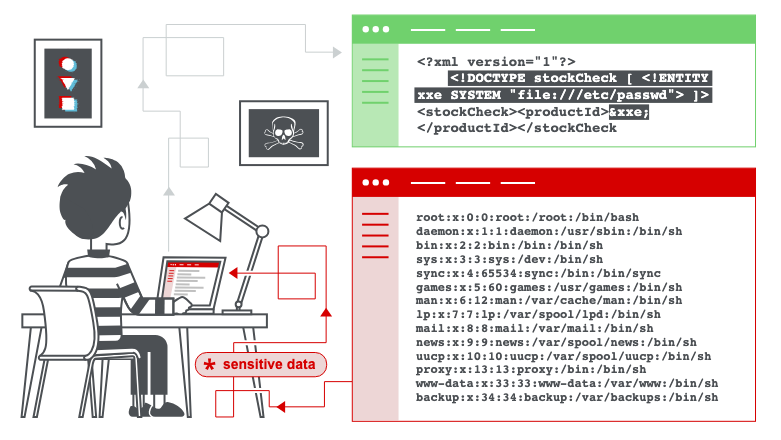

# XML external entity (XXE) injection

By: 1PingSun

Ref: [https://portswigger.net/web-security/xxe](https://portswigger.net/web-security/xxe)

---

在本節中，我們將解釋什麼是 XML 外部實體注入，描述一些常見的範例，說明如何找到並利用各種類型的 XXE 注入，並總結如何防範 XXE 注入攻擊。

## 什麼是 XML 外部實體注入？

XML 外部實體注入（也稱為 XXE）是一種網路安全漏洞，允許攻擊者干擾應用程式對 XML 資料的處理。它通常允許攻擊者檢視應用程式伺服器檔案系統上的檔案，並與應用程式本身能夠存取的任何後端或外部系統進行互動。

在某些情況下，攻擊者可以利用 XXE 漏洞執行伺服器端請求偽造（SSRF）攻擊，將 XXE 攻擊升級為入侵底層伺服器或其他後端基礎設施。



圖片來源：[https://portswigger.net/web-security/xxe](https://portswigger.net/web-security/xxe)

## XXE 漏洞是如何產生的？

有些應用程式使用 XML 格式在瀏覽器和伺服器之間傳輸資料。執行此操作的應用程式幾乎總是使用標準函式庫或平台 API 來處理伺服器上的 XML 資料。XXE 漏洞會產生，是因為 XML 規範包含各種潛在危險的功能，而標準解析器會支援這些功能，即使應用程式通常不使用它們。

::: info **延伸閱讀**

* [了解 XML 格式、DTD 和外部實體](https://portswigger.net/web-security/xxe/xml-entities)
:::

XML 外部實體是一種自訂 XML 實體，其定義值從宣告它們的 DTD 外部載入。從安全角度來看，外部實體特別值得關注，因為它們允許根據檔案路徑或 URL 的內容來定義實體。

## XXE 攻擊的類型有哪些？

XXE 攻擊有多種類型：

* [利用 XXE 擷取檔案](https://portswigger.net/web-security/xxe#exploiting-xxe-to-retrieve-files)，其中定義包含檔案內容的外部實體，並在應用程式的回應中回傳。
* [利用 XXE 執行 SSRF 攻擊](https://portswigger.net/web-security/xxe#exploiting-xxe-to-perform-ssrf-attacks)，其中基於指向後端系統的 URL 定義外部實體。
* [利用盲注 XXE 進行頻外資料滲漏](https://portswigger.net/web-security/xxe/blind#exploiting-blind-xxe-to-exfiltrate-data-out-of-band)，其中敏感資料從應用程式伺服器傳輸到攻擊者控制的系統。
* [利用盲注 XXE 透過錯誤訊息擷取資料](https://portswigger.net/web-security/xxe/blind#exploiting-blind-xxe-to-retrieve-data-via-error-messages)，其中攻擊者可以觸發包含敏感資料的解析錯誤訊息。

## 利用 XXE 擷取檔案

要執行從伺服器檔案系統擷取任意檔案的 XXE 注入攻擊，您需要以兩種方式修改提交的 XML：

* 引入（或編輯）`DOCTYPE` 元素，定義包含檔案路徑的外部實體。
* 編輯 XML 中會在應用程式回應中回傳的資料值，以使用已定義的外部實體。

例如，假設一個購物應用程式透過向伺服器提交以下 XML 來檢查產品的庫存水準：

```xml
<?xml version="1.0" encoding="UTF-8"?> 
<stockCheck><productId>381</productId></stockCheck>
```

該應用程式對 XXE 攻擊沒有採取特殊的防護措施，因此您可以透過提交以下 XXE 載荷來利用 XXE 漏洞擷取 `/etc/passwd` 檔案：

```xml
<?xml version="1.0" encoding="UTF-8"?> 
<!DOCTYPE foo [ <!ENTITY xxe SYSTEM "file:///etc/passwd"> ]> 
<stockCheck><productId>&xxe;</productId></stockCheck>
```

此 XXE 載荷定義了一個外部實體 `&xxe;`，其值為 `/etc/passwd` 檔案的內容，並在 `productId` 值中使用該實體。這會導致應用程式的回應包含該檔案的內容：

```
Invalid product ID: root:x:0:0:root:/root:/bin/bash 
daemon:x:1:1:daemon:/usr/sbin:/usr/sbin/nologin 
bin:x:2:2:bin:/bin:/usr/sbin/nologin 
...
```

::: info Note

在真實世界的 XXE 漏洞中，提交的 XML 中通常會有大量的資料值，其中任何一個都可能在應用程式的回應中使用。要系統性地測試 XXE 漏洞，您通常需要個別測試 XML 中的每個資料節點，透過使用您定義的實體並查看它是否出現在回應中。
:::

::: tip Lab: [Exploiting XXE using external entities to retrieve files](https://portswigger.net/web-security/xxe/lab-exploiting-xxe-to-retrieve-files)

1. 題目說明在 "Check stock" 功能的地方能夠解析輸入的 XML。需存取 `/etc/passwd` 檔案以通過 Lab。
2. 嘗試在網站中點擊 "Check stock"，其會發送至 API `/product/stock`。請求 Body 如下：
    ```xml
    <?xml version="1.0" encoding="UTF-8"?><stockCheck><productId>1</productId><storeId>1</storeId></stockCheck>
    ```
3. 進行 XXE Injection，修改請求 Body：
    ```xml
    <?xml version="1.0" encoding="UTF-8"?>
    <!DOCTYPE foo [ <!ENTITY xxe SYSTEM "file:///etc/passwd"> ]>
    <stockCheck><productId>&xxe;</productId><storeId>
    1</storeId></stockCheck>
    ```
4. 成功取得 `/etc/passwd` 檔案內容。
:::

## 利用 XXE 執行 SSRF 攻擊

除了擷取敏感資料外，XXE 攻擊的另一個主要影響是它們可以用來執行伺服器端請求偽造（SSRF）。這是一個潛在的嚴重漏洞，其中伺服器端應用程式可能被誘導向伺服器可以存取的任何 URL 發出 HTTP 請求。

要利用 XXE 漏洞執行 SSRF 攻擊，您需要使用想要攻擊的 URL 定義外部 XML 實體，並在資料值中使用定義的實體。如果您可以在應用程式回應中回傳的資料值中使用定義的實體，那麼您將能夠在應用程式的回應中查看來自該 URL 的回應，從而與後端系統獲得雙向互動。如果不能，那麼您只能執行盲注 SSRF 攻擊（這仍然可能帶來嚴重後果）。

在以下 XXE 範例中，外部實體將導致伺服器向組織基礎設施內的內部系統發出後端 HTTP 請求：

```xml
<!DOCTYPE foo [ <!ENTITY xxe SYSTEM "http://internal.vulnerable-website.com/"> ]>
```